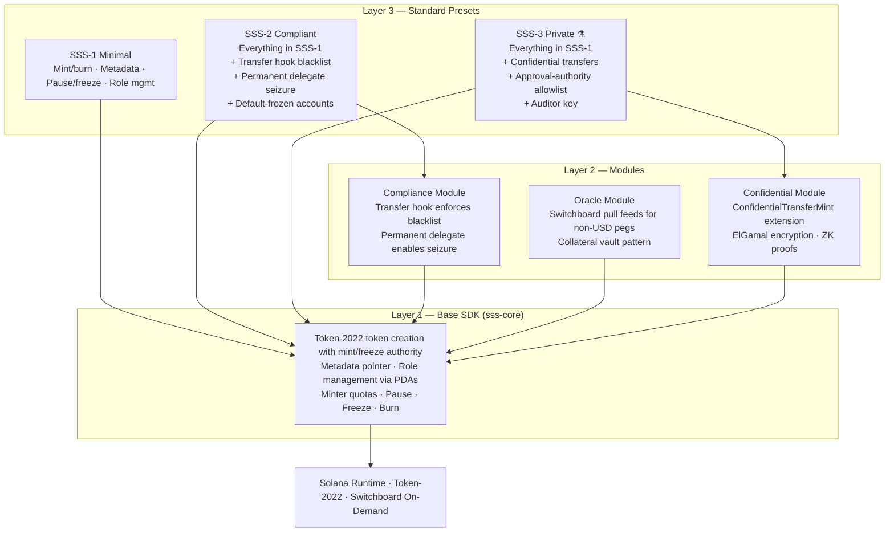
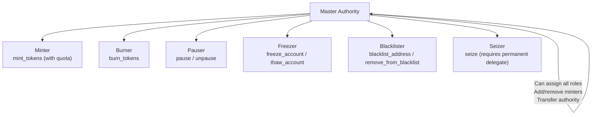
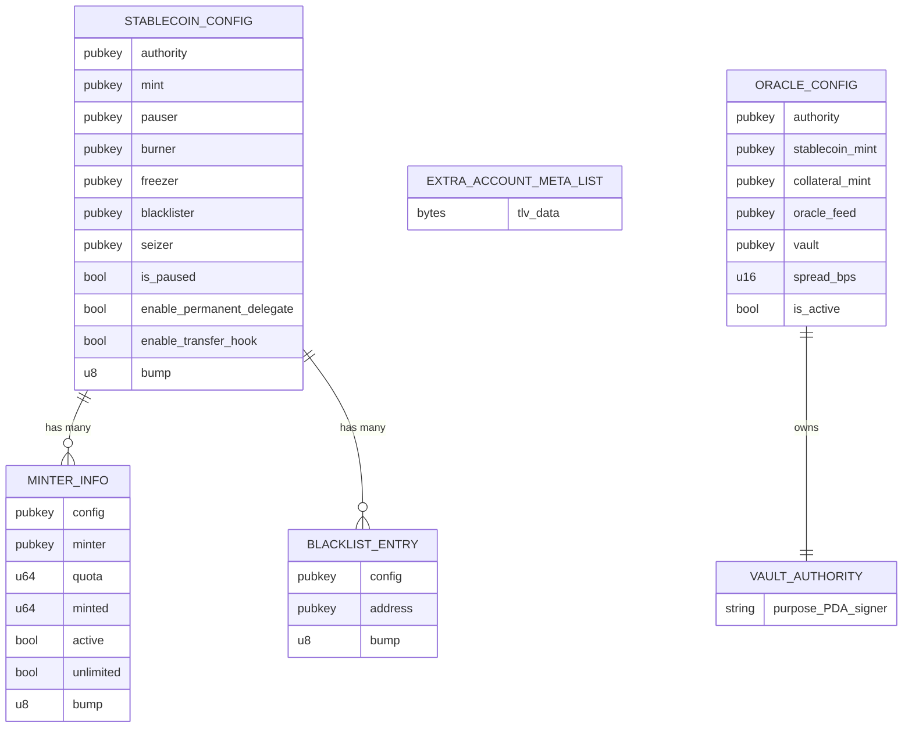
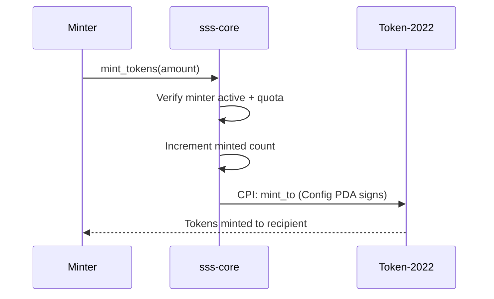
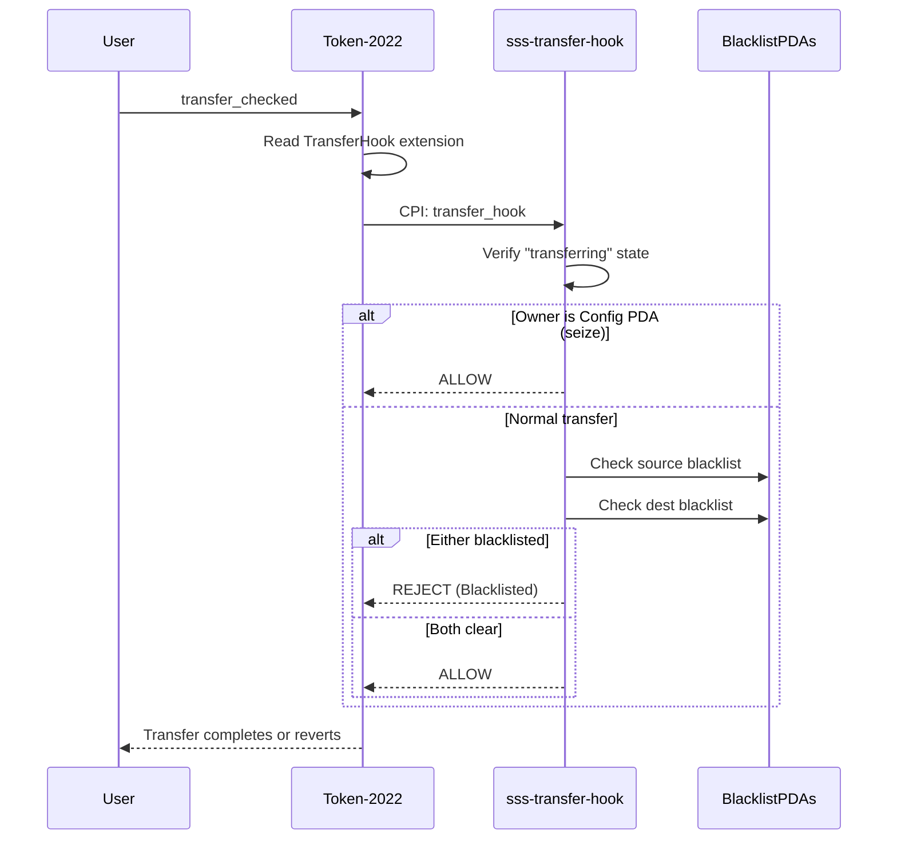
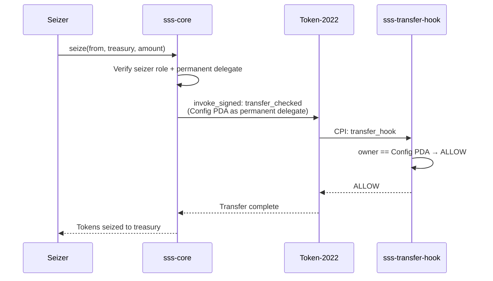
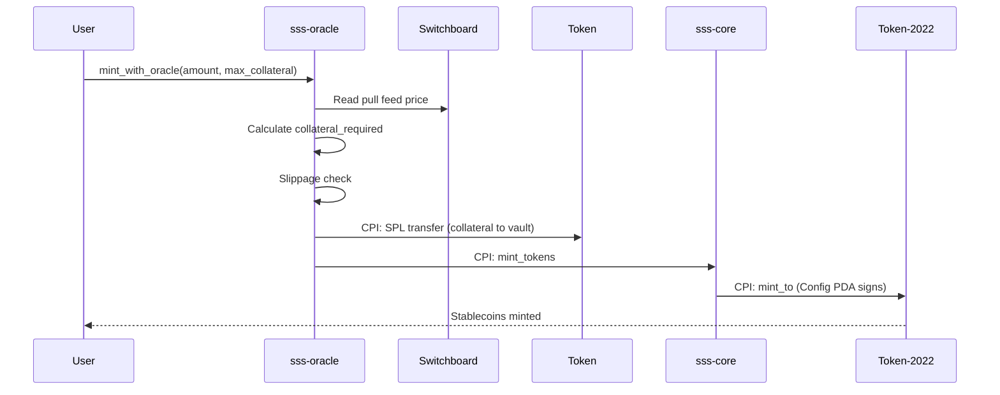
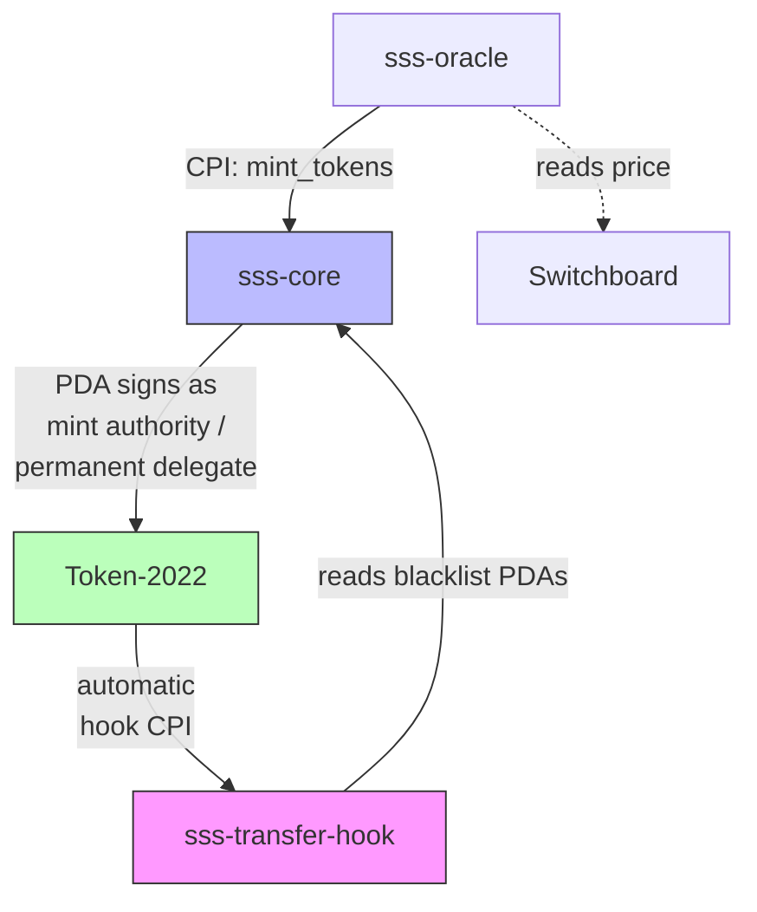
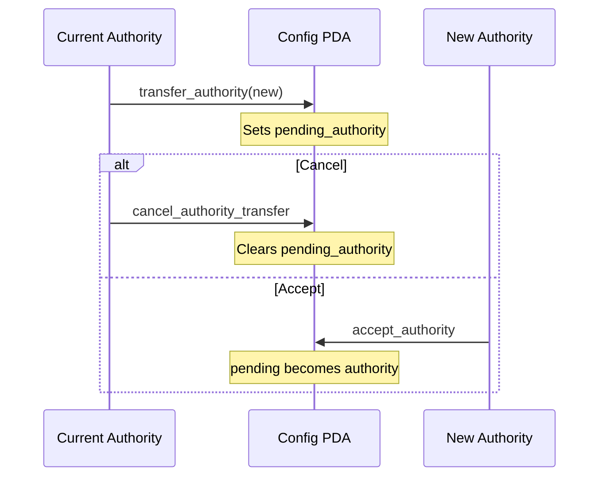
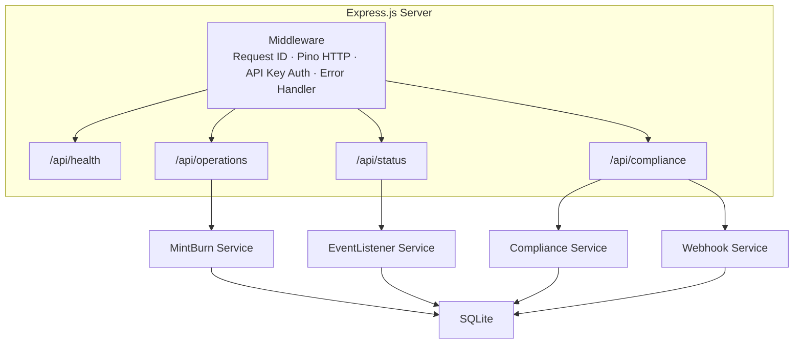

# Solana Stablecoin Standard (SSS) -- Architecture

This document describes the architecture of the Solana Stablecoin Standard,
a modular framework for issuing regulated stablecoins on Solana using
Token-2022.

---

## Table of Contents

1. [Layer Model](#layer-model)
2. [On-Chain Programs](#on-chain-programs)
3. [Account Structure](#account-structure)
4. [Data Flows](#data-flows)
5. [Security Model](#security-model)
6. [Backend Architecture](#backend-architecture)

---

## Layer Model

The system is organized into three layers. Each layer builds on the one
below it, and consumers pick the layer that matches their requirements.



### Layer 1 -- Base SDK

The foundation is `sss-core`, a single Anchor program that creates a
Token-2022 mint and manages all operational roles through a
`StablecoinConfig` PDA. The config PDA holds both mint authority and
freeze authority over the token, meaning no tokens can be created or
frozen without going through the program.

Role management is granular: separate keys control minting, burning,
freezing, blacklisting, pausing, and seizing. Minters are tracked in
individual `MinterInfo` PDAs with per-minter quotas.

### Layer 2 -- Modules

Modules extend the base with opt-in capabilities:

**Compliance Module** (`sss-transfer-hook`): A Token-2022 transfer hook
program that intercepts every `transfer_checked` call. It derives
`BlacklistEntry` PDAs for both the source and destination wallet and
rejects the transfer if either account is blacklisted. The hook uses
`ExtraAccountMetaList` so that Token-2022 automatically resolves the
required accounts -- callers do not need to know about the blacklist
check.

**Oracle Module** (`sss-oracle`): Reads price data from Switchboard
On-Demand pull feeds to support stablecoins pegged to non-USD assets
(e.g., EUR, GBP). Users deposit collateral into a program-owned vault;
the oracle calculates the required collateral amount based on the current
price plus a configurable spread (fee in basis points), then CPIs into
`sss-core::mint_tokens` to issue stablecoins.

### Layer 3 -- Standard Presets

Presets are opinionated configurations of the base program:

| Preset | Description | Init Parameters |
|--------|-------------|-----------------|
| **SSS-1** (Minimal) | Basic stablecoin with mint, burn, pause, freeze, metadata. No compliance features. | `enable_permanent_delegate: false`, `enable_transfer_hook: false`, `default_account_frozen: false` |
| **SSS-2** (Compliant) | Full regulatory toolkit. Blacklist enforcement on every transfer, seizure via permanent delegate, new accounts default to frozen (require explicit thaw). | `enable_permanent_delegate: true`, `enable_transfer_hook: true`, `default_account_frozen: true`, `transfer_hook_program_id: Some(<hook_program>)` |
| **SSS-3** (Private) | Privacy-preserving stablecoin with confidential transfers and allowlist model. Amounts and balances encrypted on-chain. Experimental — ZK program currently disabled. | `enable_permanent_delegate: false`, `enable_transfer_hook: false`, `enable_confidential_transfer: true` |

Both presets use the same `sss-core` program -- the difference is which
Token-2022 extensions are enabled at initialization time.

SSS-3 also uses `sss-core` for base token functionality but adds Token-2022's `ConfidentialTransferMint` extension client-side. Transfer hooks are incompatible with confidential transfers, so SSS-3 uses an approval-authority allowlist pattern instead of SSS-2's blacklist model.

---

## On-Chain Programs

### 1. sss-core

```
Program ID:  4H5fRECQ4HLMGhabHEkzAya34pVZn8WBMqUw5TyhMAvb
Framework:   Anchor
Token:       Token-2022
```

Single configurable program supporting both SSS-1 and SSS-2 presets. The
`StablecoinConfig` PDA stores all configuration and serves as the mint
authority, freeze authority, and (when enabled) permanent delegate.

**Instructions (18 total):**

| # | Instruction | Access | Description |
|---|-------------|--------|-------------|
| 1 | `initialize` | Authority | Create mint + config PDA with chosen extensions |
| 2 | `mint_tokens` | Minter | Mint tokens to a recipient (quota-enforced) |
| 3 | `burn_tokens` | Burner | Burn tokens from a token account |
| 4 | `freeze_account` | Freezer | Freeze a token account |
| 5 | `thaw_account` | Freezer | Thaw a frozen token account |
| 6 | `pause` | Pauser | Pause all mint/burn operations globally |
| 7 | `unpause` | Pauser | Resume operations |
| 8 | `add_minter` | Authority | Register a new minter with quota |
| 9 | `remove_minter` | Authority | Deactivate and close a minter PDA |
| 10 | `update_minter` | Authority | Modify minter quota/active/unlimited flags |
| 11 | `update_roles` | Authority | Reassign pauser, burner, freezer, blacklister, seizer |
| 12 | `transfer_authority` | Authority | Propose authority transfer (two-step) |
| 13 | `accept_authority` | Pending Authority | Accept proposed authority transfer |
| 14 | `cancel_authority_transfer` | Authority | Cancel pending authority transfer |
| 15 | `blacklist_address` | Blacklister | Create a BlacklistEntry PDA for an address |
| 16 | `remove_from_blacklist` | Blacklister | Close a BlacklistEntry PDA |
| 17 | `seize` | Seizer | Transfer tokens from any account using permanent delegate |
| 18 | Not yet implemented | -- | Reserved (instruction space in mod.rs) |

**Role hierarchy:**



### 2. sss-transfer-hook

```
Program ID:  2VymphXYSrCV4qtS3FyiGmNQvcNrEXNUyRUh9MhDTLH9
Framework:   Anchor + spl-transfer-hook-interface
```

Token-2022 transfer hook that checks source and destination wallet owners
against `BlacklistEntry` PDAs stored by `sss-core`. The hook is invoked
automatically by Token-2022 on every `transfer_checked` call for mints
that have the TransferHook extension enabled.

**Instructions (2):**

| Instruction | Description |
|-------------|-------------|
| `initialize_extra_account_meta_list` | Create the ExtraAccountMetaList PDA with resolution rules |
| `transfer_hook` | Check blacklist PDAs; reject if either party is blacklisted |

**ExtraAccountMetaList resolution (4 extra accounts):**

| Index | Account | Derivation |
|-------|---------|------------|
| 5 | sss-core program ID | Literal pubkey |
| 6 | StablecoinConfig PDA | External PDA: seeds `["stablecoin_config", mint]` on sss-core |
| 7 | Source BlacklistEntry | External PDA: seeds `["blacklist_seed", config, source_owner]` on sss-core |
| 8 | Dest BlacklistEntry | External PDA: seeds `["blacklist_seed", config, dest_owner]` on sss-core |

The hook allows transfers initiated by the config PDA itself (i.e., seize
operations using the permanent delegate), so regulatory seizure is not
blocked by the blacklist check.

### 3. sss-oracle

```
Program ID:  GnEKCqWBDCTzLHrCTiRT6Mi1a37PHSsAoFBowLKPT2PH
Framework:   Anchor + Switchboard On-Demand
```

Reads Switchboard pull feed prices, calculates collateral requirements
with a configurable spread, and CPIs into `sss-core` for minting and
redeeming. Uses a vault pattern where collateral is held in a
program-owned token account.

**Instructions (6):**

| Instruction | Access | Description |
|-------------|--------|-------------|
| `initialize_oracle` | Authority | Create OracleConfig + vault, register vault_authority as minter in sss-core |
| `mint_with_oracle` | User | Deposit collateral, read price, CPI mint stablecoins |
| `redeem_with_oracle` | User | Burn stablecoins, read price, return collateral from vault |
| `update_oracle_feed` | Authority | Change the Switchboard feed address |
| `update_oracle_params` | Authority | Update staleness, spread, active flag |
| `withdraw_fees` | Authority | Withdraw accumulated spread fees from vault |

**Price calculation:**

```
collateral = stablecoin_amount * oracle_price / 10^18
           * decimal_adjustment
           * (10000 + spread_bps) / 10000     [mint: user pays more]
           * (10000 - spread_bps) / 10000     [redeem: user receives less]
```

Switchboard On-Demand returns prices as `i128` with 18 decimal places of
precision. The oracle enforces staleness checks (`max_stale_slots`,
default 150 slots / ~60s) and minimum sample counts (`min_samples`).

---

## Account Structure

### PDA Derivation Map



### StablecoinConfig Fields

```
+---------------------------+----------+---------------------------------------+
| Field                     | Type     | Description                           |
+---------------------------+----------+---------------------------------------+
| authority                 | Pubkey   | Master authority                      |
| mint                      | Pubkey   | Token-2022 mint address               |
| pauser                    | Pubkey   | Can pause/unpause                     |
| burner                    | Pubkey   | Can burn tokens                       |
| freezer                   | Pubkey   | Can freeze/thaw accounts              |
| blacklister               | Pubkey   | Can manage blacklist                  |
| seizer                    | Pubkey   | Can seize tokens                      |
| pending_authority         | Option   | Two-step authority transfer target    |
| decimals                  | u8       | Token decimal places                  |
| is_paused                 | bool     | Global pause flag                     |
| has_metadata              | bool     | Whether metadata extension is active  |
| total_minters             | u16      | Count of registered minters           |
| enable_permanent_delegate | bool     | SSS-2: seizure capability             |
| enable_transfer_hook      | bool     | SSS-2: blacklist enforcement          |
| default_account_frozen    | bool     | SSS-2: accounts start frozen          |
| bump                      | u8       | Canonical PDA bump                    |
| _reserved                 | [u8; 32] | Reserved for future upgrades          |
+---------------------------+----------+---------------------------------------+
```

---

## Data Flows

### SSS-1 Mint Flow

Minter calls `sss-core::mint_tokens` directly. The config PDA signs the
Token-2022 `mint_to` CPI.



### SSS-2 Transfer Flow (with Blacklist Enforcement)

User initiates a standard `transfer_checked`. Token-2022 automatically
invokes the transfer hook.



### SSS-2 Seize Flow

Seizer authority triggers a transfer from any account to treasury, using
the config PDA as permanent delegate.



### Oracle Mint Flow

User deposits collateral and receives stablecoins at the oracle-determined
exchange rate.



### Program Interaction Diagram



---

## Security Model

### Role Separation

No single key controls the entire system. The master authority can assign
roles but cannot directly mint, burn, or seize without holding the
corresponding role. Each role (minter, burner, pauser, freezer,
blacklister, seizer) is a separate public key stored in the
`StablecoinConfig` PDA.

### Two-Step Authority Transfer

Authority transfers follow a propose-accept pattern:



This prevents accidental or malicious transfers to incorrect addresses.

### Transfer Hook Guarantees

Once a mint is created with the `TransferHook` extension enabled, the
hook program is embedded in the mint account data. Token-2022 enforces
that every `transfer_checked` call invokes the hook. There is no way to
bypass this at the protocol level -- all transfers for that mint must pass
through the blacklist check.

### Permanent Delegate

When `enable_permanent_delegate` is set during initialization, the
`StablecoinConfig` PDA is registered as the permanent delegate for the
mint. This gives the program unconditional transfer authority over any
token account holding that mint, enabling regulatory seizure without
holder cooperation.

### SSS-2 Feature Gating

SSS-2 features (permanent delegate, transfer hook, default-frozen
accounts) are flags set at initialization time. If a feature is not
enabled, the corresponding instructions fail with
`ComplianceNotEnabled`. This means an SSS-1 deployment cannot be
accidentally or maliciously upgraded to SSS-2 after the fact -- the
Token-2022 extensions must be present on the mint from creation.

### Checked Arithmetic

All arithmetic operations use `checked_add`, `checked_sub`,
`checked_mul`, and `checked_div` with explicit error handling. The oracle
price calculation rounds up on mint (protecting the protocol from
undercollateralization) and rounds down on redeem (user receives slightly
less).

### Oracle Safeguards

- **Staleness**: Prices older than `max_stale_slots` (default 150 slots,
  approximately 60 seconds) are rejected.
- **Sample count**: Prices with fewer than `min_samples` oracle
  submissions are rejected.
- **Slippage protection**: Users specify `max_collateral` (mint) or
  `min_collateral` (redeem) to bound price movement between submission
  and execution.
- **Spread**: A configurable fee in basis points (max 1000 bps / 10%)
  provides a buffer against price volatility and generates protocol
  revenue.

---

## Backend Architecture

The backend is an Express.js API server that provides an operational
interface for managing a deployed stablecoin.

### Component Overview



### Services

**MintBurnService**: Constructs and submits mint/burn transactions to
Solana. Handles PDA derivation, account resolution, and transaction
signing with the configured authority keypair.

**EventListenerService**: Polls the Solana RPC for program log events at a
configurable interval. Parses Anchor event discriminators from transaction
logs, deserializes event data, and stores events in SQLite. Emits events
to registered callbacks (e.g., the webhook service).

**ComplianceService**: Manages blacklist operations (add/remove addresses)
and freeze/thaw operations. When the transfer hook is configured, handles
the ExtraAccountMetaList initialization and account resolution for
hook-aware transfers.

**WebhookService**: Stores webhook endpoint URLs in SQLite. When events
arrive from the EventListenerService, dispatches HTTP POST notifications
to registered endpoints. Includes a background retry processor for failed
deliveries.

### Infrastructure

- **Database**: SQLite via `better-sqlite3` for zero-config persistence
  of events, webhook registrations, and delivery state.
- **Logging**: Structured JSON logging via Pino with child loggers per
  service (`{ service: "mint-burn" }`, etc.).
- **Authentication**: Optional API key via `x-api-key` header. The
  `/api/health` endpoint is exempt.
- **Graceful shutdown**: SIGINT/SIGTERM handlers stop background services,
  close the database, and drain the HTTP server.

---

## Directory Structure

```
stablecoin-standard/
  programs/
    sss-core/            Core stablecoin program (18 instructions)
    sss-transfer-hook/   Token-2022 transfer hook (blacklist enforcement)
    sss-oracle/          Oracle-priced mint/redeem with collateral vault
  sdk/
    core/                TypeScript SDK for sss-core
    oracle/              TypeScript SDK for sss-oracle
  modules/
    oracle/              Oracle module integration
    confidential/        Confidential transfer module (SSS-3, experimental)
  backend/               Express.js API server
    src/
      services/          MintBurn, EventListener, Compliance, Webhook
      routes/            REST API endpoints
      middleware/         Request ID, error handling
      utils/             Logger, database
  cli/                   Command-line interface
  frontend/              Web frontend
  scripts/               Deployment and setup scripts
  tests/                 Integration tests
```
