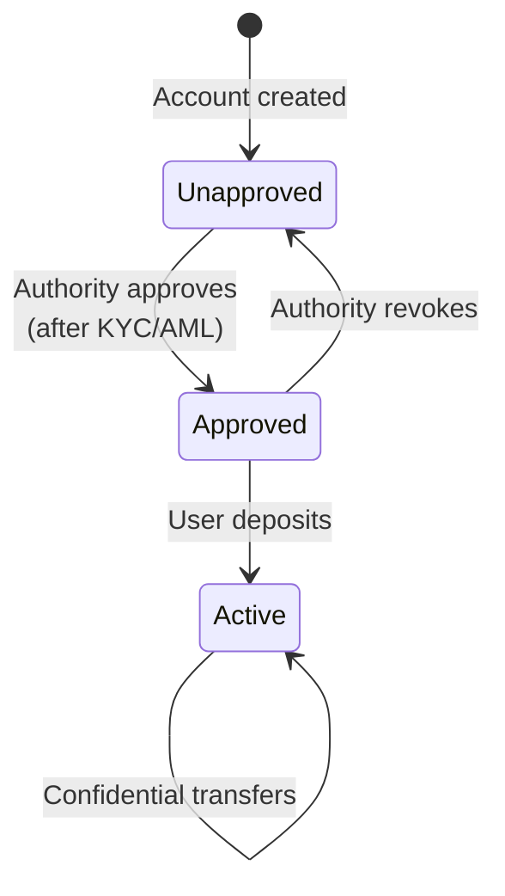
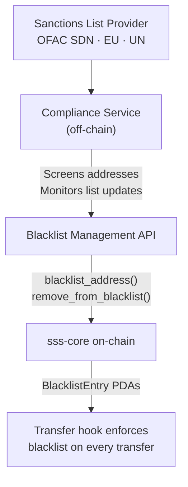

# Compliance Documentation

## Solana Stablecoin Standard (SSS)

---

## Overview

The Solana Stablecoin Standard provides a compliance tooling framework for stablecoin issuers operating on Solana. The framework is implemented across two specification tiers:

- **SSS-1 (Minimal):** Reactive compliance through freeze authority and emergency pause.
- **SSS-2 (Compliant):** Proactive compliance through transfer-level blacklist enforcement, regulatory seizure, and an allowlist account model.
- **SSS-3 (Private):** Privacy-preserving compliance through confidential transfers with encrypted amounts, approval-authority allowlists, and an auditor key for regulatory visibility. Experimental — ZK program currently disabled.

Both tiers share a common on-chain program (`sss-core`) and role-based access control system. The tier is selected at token initialization and is immutable thereafter. This document describes the compliance capabilities of each tier, the audit infrastructure, integration points for sanctions screening, access control design, and operational best practices.

---

## Regulatory Landscape

### GENIUS Act

The Guiding and Establishing National Innovation for U.S. Stablecoins (GENIUS) Act establishes a federal regulatory framework for payment stablecoins. Key compliance-relevant requirements include:

- **Reserve requirements:** Issuers must maintain one-to-one reserves in high-quality liquid assets.
- **Redemption rights:** Holders must be able to redeem tokens at par.
- **Compliance controls:** Issuers must implement sanctions screening, anti-money laundering controls, and the ability to freeze or seize assets pursuant to legal process.
- **Record keeping:** Issuers must maintain records sufficient for regulatory examination.

SSS does not address reserve management or redemption (those are off-chain operational concerns). SSS provides the on-chain compliance controls and record-keeping infrastructure that the Act requires.

### OFAC Sanctions

The Office of Foreign Assets Control (OFAC) maintains the Specially Designated Nationals (SDN) list and other sanctions programs. All US persons -- including stablecoin issuers and their users -- are prohibited from engaging in transactions with sanctioned parties.

For on-chain tokens, this means the issuer must have a mechanism to prevent sanctioned addresses from sending or receiving tokens. SSS-1 provides this reactively (freeze after detection). SSS-2 provides this proactively (block at transfer time).

### AML Requirements

Anti-Money Laundering (AML) regulations require financial institutions to:

- Know their customers (KYC).
- Monitor transactions for suspicious activity.
- File Suspicious Activity Reports (SARs) with FinCEN.
- Maintain records for a minimum of five years.

SSS supports AML compliance through the allowlist model (SSS-2 default-frozen accounts enforce KYC gating), on-chain event logging (transaction monitoring input), and blacklist management (enforcement output).

---

## SSS-1 Compliance: Reactive Model

SSS-1 provides a reactive compliance posture suitable for tokens where regulatory requirements are limited or where compliance is primarily handled off-chain.

### Freeze Authority

The Config PDA holds freeze authority over the Token-2022 mint. The freezer role can freeze individual token accounts in response to:

- Sanctions list matches detected by off-chain screening.
- Law enforcement requests or court orders.
- Detected fraud or account compromise.
- Dispute resolution processes.

**Capabilities:**

| Action | Instruction | Effect |
|--------|-------------|--------|
| Freeze account | `freeze_account` | Account cannot send or receive tokens. |
| Thaw account | `thaw_account` | Account is restored to normal operation. |

**Limitation:** Freezing is reactive. If a sanctioned address sends tokens before being frozen, the transfer succeeds. There is no mechanism to block the transfer at execution time in SSS-1.

### Emergency Pause

The pauser role can halt all `sss-core` program operations:

- Minting is blocked (no new token issuance).
- Burning is blocked.
- Freezing and thawing are blocked.
- Role updates and authority transfers are blocked.

**Limitation:** Pause does not stop Token-2022 transfers. Users can still transfer tokens between non-frozen accounts while the stablecoin is paused. Pause is a circuit breaker for the administrative layer, not for token movement. To stop all token movement in SSS-1, each account must be individually frozen.

### Event Logging

All SSS-1 operations emit on-chain events that can be captured by indexers:

- `Initialized` -- Token creation.
- `TokensMinted` -- Minting operations with minter identity and amount.
- `TokensBurned` -- Burning operations with burner identity and amount.
- `AccountFrozen` -- Freeze operations with target account.
- `AccountThawed` -- Thaw operations with target account.
- `Paused` / `Unpaused` -- Pause state changes.
- `MinterAdded` / `MinterRemoved` / `UpdatedMinter` -- Minter management.
- `RolesUpdated` -- Role assignment changes.
- `AuthorityTransferProposed` / `AuthorityTransferAccepted` / `AuthorityTransferCancelled` -- Authority management.

These events provide a complete audit trail of all administrative actions taken on the token.

---

## SSS-2 Compliance: Proactive Model

SSS-2 extends SSS-1 with proactive enforcement mechanisms that prevent non-compliant transfers from executing. This is the appropriate tier for tokens subject to OFAC sanctions requirements, the GENIUS Act, or other regulatory frameworks that require transfer-level controls.

### Transfer Hook Blacklist Enforcement

The `sss-transfer-hook` program is invoked by Token-2022 on every `transfer_checked` call. There are no gaps in enforcement -- every transfer is checked, including transfers initiated by wallets, DEX programs, lending protocols, and any other program that moves tokens.

**How it works:**

1. Token-2022 calls `sss-transfer-hook::transfer_hook` with the source token account, destination token account, mint, owner, and amount.
2. The hook derives the blacklist PDA for the source account's owner: `["blacklist_seed", config_pubkey, source_owner_pubkey]`.
3. The hook derives the blacklist PDA for the destination account's owner: `["blacklist_seed", config_pubkey, dest_owner_pubkey]`.
4. If either PDA account contains data (a `BlacklistEntry` exists), the transfer is denied with a `Blacklisted` error and the entire transaction reverts.
5. If both PDA accounts are empty (no blacklist entry), the transfer proceeds.

**Exception:** Transfers where the signing authority is the Config PDA are always allowed. This permits the `seize` instruction to transfer tokens out of blacklisted accounts.

**Enforcement guarantees:**

- Blacklisted addresses cannot send tokens.
- Blacklisted addresses cannot receive tokens.
- Blacklist enforcement applies to all callers, including CPIs from other programs.
- There is no way to bypass the transfer hook for `transfer_checked` calls on a Token-2022 mint with the TransferHook extension enabled.

### Permanent Delegate and Seizure

The Config PDA is the permanent delegate on the Token-2022 mint. This means the Config PDA can transfer tokens out of any token account associated with this mint without the account owner's consent.

This capability is exposed through the `seize` instruction, gated by the seizer role. Seizure is the mechanism for:

- Court-ordered asset recovery.
- Regulatory confiscation pursuant to legal process.
- Recovery of tokens from sanctioned accounts (transfer to a treasury controlled by the issuer).

**Seizure process:**

1. The seizer calls `sss-core::seize(from, treasury, amount)`.
2. The program validates the seizer role, checks that the stablecoin is not paused, and confirms that permanent delegate is enabled.
3. The program builds a `transfer_checked` instruction with the Config PDA as the signing authority (permanent delegate).
4. Token-2022 executes the transfer. The transfer hook allows it because the signer is the Config PDA.
5. Tokens move from the target account to the treasury account.
6. A `TokensSeized` event is emitted with the source, destination, and amount.

**Seizure does not require the target account to be thawed.** The permanent delegate can transfer tokens from frozen accounts. However, if the transfer hook is enabled and the target is blacklisted, the seizure still succeeds because the hook exempts Config PDA-signed transfers.

### Default Frozen Accounts: Allowlist Model

When `default_account_frozen` is enabled, every new token account created for this mint starts in a frozen state. The account owner cannot send or receive tokens until the freezer role calls `thaw_account`.

This implements an allowlist model:

1. A user creates a token account for the SSS-2 mint.
2. The account is frozen by default. The user cannot transact.
3. The user completes KYC/AML verification through the issuer's off-chain process.
4. The issuer's compliance system calls `thaw_account` to activate the account.
5. The user can now send and receive tokens, subject to transfer hook blacklist checks.

If a user later fails ongoing due diligence (e.g., adverse media screening, expired documentation), the freezer role can re-freeze their account.

### Blacklist Management

Blacklist entries are managed through two instructions:

| Instruction | Effect | Rent |
|-------------|--------|------|
| `blacklist_address(address)` | Creates a `BlacklistEntry` PDA. All transfers involving this address are blocked. | Blacklister pays rent. |
| `remove_from_blacklist(address)` | Closes the `BlacklistEntry` PDA. Transfers are unblocked. | Rent returned to blacklister. |

**Key properties:**

- Blacklisting is at the wallet address level, not the token account level. A blacklisted address is blocked across all its token accounts for this mint.
- Blacklist entries are per-stablecoin. Blacklisting an address on one SSS-2 token does not affect other SSS tokens.
- Blacklisting requires the `enable_transfer_hook` flag to be `true`. Attempting to blacklist on an SSS-1 token returns `ComplianceNotEnabled`.
- The blacklister role is separate from the freezer, seizer, and authority roles. An organization can assign blacklist management to its compliance team without granting them broader administrative access.

---

## SSS-3 Compliance: Privacy-Preserving Model

SSS-3 introduces a fundamentally different compliance approach: instead of blocking transfers via blacklists, SSS-3 encrypts transfer amounts while maintaining address-level transparency and providing auditor access to all amounts.

### Approval-Authority Allowlist

SSS-3 replaces SSS-2's blacklist enforcement with an allowlist model:

1. `auto_approve_new_accounts = false` on the `ConfidentialTransferMint` extension.
2. New token accounts cannot participate in confidential transfers until the authority calls `ApproveAccount`.
3. Only approved accounts can send and receive confidential transfers.

This is functionally equivalent to SSS-2's approach but inverted: deny by default, explicitly approve.

### Auditor Key

Every SSS-3 mint includes an `auditor_elgamal_pubkey`. When set:

- Every confidential transfer encrypts the amount for the auditor in addition to sender and recipient.
- The auditor can decrypt all transfer amounts for regulatory reporting.
- The auditor cannot spend tokens or modify balances.

This provides a compliance bridge: amounts are private on-chain but auditable by authorized parties.

### Privacy Scope

| Visible On-Chain | Encrypted On-Chain |
|------------------|--------------------|
| Sender address | Transfer amount |
| Recipient address | Account balance |
| Transaction timestamp | |
| That a confidential transfer occurred | |

### SSS-3 Limitations for Compliance

- **No transfer-level blocking:** Confidential transfers are incompatible with transfer hooks. Compliance is enforced at the account level (approval/revocation), not at the transfer level.
- **No seizure:** SSS-3 does not use a permanent delegate. Tokens cannot be forcibly transferred. The authority can revoke account approval to prevent future transfers.
- **Experimental status:** The ZK ElGamal Proof Program is disabled on devnet/mainnet. SSS-3 is a proof-of-concept.

---

## Audit Trail

### On-Chain Events

Every administrative and compliance action emits an Anchor program event. These events are included in the transaction log and can be parsed by any Solana indexer.

**Complete event catalog:**

| Event | Fields | Compliance Relevance |
|-------|--------|---------------------|
| `Initialized` | mint, authority, name, symbol, decimals, has_metadata | Token creation record |
| `TokensMinted` | mint, minter, recipient, amount | Issuance tracking |
| `TokensBurned` | mint, burner, amount | Redemption tracking |
| `AccountFrozen` | mint, account, authority | Restriction enforcement |
| `AccountThawed` | mint, account, authority | Restriction removal |
| `Paused` | mint, pauser | Emergency action record |
| `Unpaused` | mint, pauser | Recovery action record |
| `AddedToBlacklist` | mint, address | Sanctions enforcement |
| `RemovedFromBlacklist` | mint, address | Sanctions de-listing |
| `TokensSeized` | mint, from, treasury, amount | Regulatory seizure record |
| `MinterAdded` | mint, minter_address, quota, unlimited | Access grant record |
| `MinterRemoved` | mint, minter_address | Access revocation record |
| `UpdatedMinter` | mint, minter_address, active, quota | Access modification record |
| `RolesUpdated` | mint, old/new for each role | Administrative change record |
| `AuthorityTransferProposed` | mint, current_authority, proposed_authority | Governance change initiation |
| `AuthorityTransferAccepted` | mint, old_authority, new_authority | Governance change completion |
| `AuthorityTransferCancelled` | mint, authority, cancelled_pending | Governance change rollback |

### Backend Event Indexer

The project includes a backend event indexer (`backend/`) that continuously monitors the Solana blockchain for SSS program events and stores them in a queryable database. This indexer provides:

- Real-time event capture from on-chain program logs.
- Persistent storage for historical event data.
- Query interface for compliance reporting.
- Webhook notifications for critical events (blacklist changes, seizures, pauses).

### Export Format for Regulatory Reporting

The indexed events can be exported in structured formats suitable for regulatory examination:

- **Chronological audit log:** All events ordered by slot and transaction index.
- **Per-address activity report:** All events affecting a specific wallet address.
- **Minting/burning report:** All issuance and redemption events with counterparties and amounts.
- **Compliance action report:** All freeze, thaw, blacklist, and seizure events.
- **Role change report:** All administrative and role assignment changes.

---

## Sanctions Screening

### Integration Architecture

SSS provides the on-chain enforcement layer for sanctions compliance. The off-chain screening layer determines which addresses should be blacklisted. The integration follows this pattern:

### Blacklist Management API

The compliance service interacts with the blockchain through the SSS SDK (`sdk/core/`). The SDK provides functions to:

- Add an address to the blacklist.
- Remove an address from the blacklist.
- Query whether an address is blacklisted (by checking if the BlacklistEntry PDA exists).
- List all blacklisted addresses for a given stablecoin (by scanning BlacklistEntry accounts).

### Webhook Notifications

The backend indexer can be configured to send webhook notifications for compliance-critical events:

- **AddedToBlacklist:** Notifies compliance team that enforcement is active.
- **RemovedFromBlacklist:** Notifies compliance team that enforcement is lifted.
- **TokensSeized:** Notifies compliance and legal teams of asset recovery.
- **Paused:** Notifies operations team of emergency stop.
- **AccountFrozen / AccountThawed:** Notifies compliance team of individual account actions.

---

## Roles and Access Control

### Separation of Duties

SSS enforces separation of duties through distinct roles stored on the Config PDA. No single key controls all aspects of the stablecoin. The role assignments are:

| Role | Responsibility | Independence |
|------|---------------|--------------|
| **Authority** | Strategic: manage minters, assign roles, transfer authority | Should be a multisig or governance program |
| **Minter** | Operational: issue new tokens within quota | Multiple minters possible, each with individual quotas |
| **Burner** | Operational: redeem/destroy tokens | Separate from minting to prevent unauthorized issuance |
| **Pauser** | Emergency: halt all administrative operations | Separate key for rapid response without broad access |
| **Freezer** | Compliance: freeze/thaw individual accounts | Separate from blacklister to allow different approval chains |
| **Blacklister** | Compliance: manage transfer-level blacklist (SSS-2) | Can be assigned to compliance team |
| **Seizer** | Legal: execute regulatory seizure (SSS-2) | Highest-impact action, should require legal authorization |

At initialization, all roles default to the initializing wallet. For production deployments, the authority must immediately distribute roles to separate keys using the `update_roles` instruction.

### Two-Step Authority Transfer

The master authority -- the most privileged role -- uses a two-step transfer process to prevent accidental loss:

1. **Propose:** Current authority calls `transfer_authority(new_authority)`. The `pending_authority` field is set.
2. **Accept:** New authority calls `accept_authority()`. Authority is transferred.
3. **Cancel (optional):** Current authority calls `cancel_authority_transfer()` if the transfer should be aborted.

This pattern ensures that the new authority address is valid and controlled by the intended party. A typo in the new authority address does not result in loss of control because the new authority must actively accept.

### Role Update Controls

- Only the authority can update roles via `update_roles`.
- Zero-address (`Pubkey::default()`) is rejected for all roles to prevent accidental disabling.
- Role changes emit a `RolesUpdated` event with both old and new values for every role, providing a complete before/after record.
- Role updates are blocked while the stablecoin is paused, preventing administrative changes during an emergency.

---

## Best Practices

### Key Management

**Hardware wallets:** All role keys should be stored on hardware wallets (e.g., Ledger) for production deployments. Software keypairs are acceptable for development and testing only.

**Multisig for authority:** The master authority should be a multisig wallet (e.g., Squads Protocol) requiring multiple signers for administrative actions. Recommended threshold: 2-of-3 or 3-of-5 depending on organizational size.

**Dedicated keys per role:** Each role should use a separate keypair. Do not reuse the authority key for operational roles. This limits blast radius if any single key is compromised.

**Key rotation:** Periodically rotate role keys using `update_roles`. The two-step authority transfer supports safe rotation of the master authority.

**Backup and recovery:** Maintain encrypted backups of all role keys with documented recovery procedures. Test recovery procedures at least annually.

### Monitoring Setup

**Backend indexer:** Deploy the backend event indexer (`backend/`) connected to a reliable Solana RPC endpoint. The indexer should run continuously with automatic restart on failure.

**TUI dashboard:** The terminal UI (`tui/`) provides real-time monitoring of stablecoin state, including current supply, pause status, minter activity, and recent events. Useful for operational monitoring by the issuer's operations team.

**Frontend dashboard:** The web frontend (`frontend/`) provides a graphical interface for managing the stablecoin, including minting, burning, freezing, blacklisting, and role management. Suitable for compliance officers and administrators who prefer a visual interface.

**Alerting:** Configure the backend to send webhook notifications for critical events. Integrate with your organization's incident management system (PagerDuty, Opsgenie, etc.) for events that require immediate response:
- `Paused` -- Investigate why emergency stop was triggered.
- `TokensSeized` -- Verify legal authorization.
- `AuthorityTransferProposed` -- Verify legitimacy of authority change.
- `AddedToBlacklist` -- Confirm sanctions match.

### Incident Response Procedures

**Compromised minter key:**
1. Pauser triggers `pause` to halt all minting immediately.
2. Authority calls `update_minter` to deactivate the compromised minter.
3. Authority calls `remove_minter` to delete the minter account.
4. Pauser triggers `unpause` after verifying the threat is contained.
5. Authority adds a new minter with a fresh key if needed.

**Compromised authority key:**
1. If a pending authority transfer was initiated by the attacker, the legitimate authority (if still in control) calls `cancel_authority_transfer`.
2. If the attacker has already transferred authority, recovery requires coordination with the Solana validator community (this is an extreme scenario). Prevention through multisig is strongly recommended.

**Sanctions match detected:**
1. Compliance service calls `blacklist_address` via the blacklister key. Immediate enforcement: no further transfers.
2. If the address holds tokens and a seizure order is obtained, the seizer calls `seize` to move tokens to a treasury.
3. If the match is a false positive, the compliance service calls `remove_from_blacklist` after resolution.
4. Document the action, the sanctions list entry, and the resolution in the compliance record.

**Smart contract vulnerability detected:**
1. Pauser triggers `pause` to halt all program operations.
2. Freezer freezes high-value accounts if there is risk of exploitation through Token-2022 transfers (which are not stopped by pause in SSS-1).
3. For SSS-2 tokens, blacklist any addresses associated with the exploit.
4. Assess the vulnerability and coordinate a program upgrade if necessary.
5. Unpause only after the vulnerability is mitigated.

### Regular Audit Recommendations

**On-chain program audit:** The `sss-core` and `sss-transfer-hook` programs should undergo a third-party security audit before mainnet deployment. Re-audit after any program upgrade.

**Operational audit (quarterly):**
- Review all role assignments. Confirm each role key is held by the intended party.
- Review minter list. Remove inactive minters. Verify quotas are appropriate.
- Review blacklist. Confirm all entries correspond to current sanctions lists.
- Review event logs for any anomalous activity (unexpected minting, unauthorized role changes).

**Compliance audit (annually):**
- Export the complete event history for the audit period.
- Reconcile on-chain minting and burning with off-chain reserve records.
- Verify that all sanctions list updates were reflected in blacklist changes within the required timeframe.
- Review incident response logs and confirm procedures were followed.
- Test the pause mechanism and key recovery procedures.

**Penetration testing (annually):**
- Test access controls by attempting privileged operations with unauthorized keys.
- Test blacklist enforcement by attempting transfers involving blacklisted addresses.
- Test seizure flow end-to-end with a test token.
- Verify that the transfer hook cannot be bypassed.

---

## Compliance Tier Selection Guide

| Requirement | SSS-1 | SSS-2 | SSS-3 |
|-------------|-------|-------|-------|
| Mint/burn controls | Yes | Yes | Yes |
| Role-based access control | Yes | Yes | Yes |
| Individual account freeze | Yes | Yes | Yes |
| Emergency pause | Yes | Yes | Yes |
| On-chain audit trail | Yes | Yes | Yes |
| Transfer-level blacklist enforcement | No | Yes | No |
| Regulatory seizure | No | Yes | No |
| Allowlist (account approval) | No | Yes | Yes |
| Amount privacy (encrypted) | No | No | Yes |
| Auditor key for regulatory access | No | No | Yes |
| OFAC sanctions compliance (proactive) | No | Yes | Partial |
| GENIUS Act compliance controls | Partial | Yes | Partial |
| Status | Active | Active | Experimental |

**Choose SSS-1 if:** Your token does not require transfer-level enforcement, you operate in a lightly regulated environment, or your compliance is primarily off-chain.

**Choose SSS-2 if:** You are subject to OFAC sanctions requirements, the GENIUS Act, banking regulations, or any framework that requires the issuer to prevent non-compliant transfers at execution time.

**Choose SSS-3 if:** You need amount privacy for institutional settlement, payroll, or jurisdictions requiring transaction confidentiality, and you can enforce compliance at the account level (approval/revocation) rather than at the transfer level. Note: SSS-3 is experimental and cannot be deployed to devnet/mainnet until the ZK ElGamal Proof Program is re-enabled.

---

## Reference

- **sss-core program:** `4H5fRECQ4HLMGhabHEkzAya34pVZn8WBMqUw5TyhMAvb`
- **sss-transfer-hook program:** `2VymphXYSrCV4qtS3FyiGmNQvcNrEXNUyRUh9MhDTLH9`
- **SSS-1 specification:** [SSS-1.md](./SSS-1.md)
- **SSS-2 specification:** [SSS-2.md](./SSS-2.md)
- **SSS-3 specification:** [SSS-3.md](./SSS-3.md)
