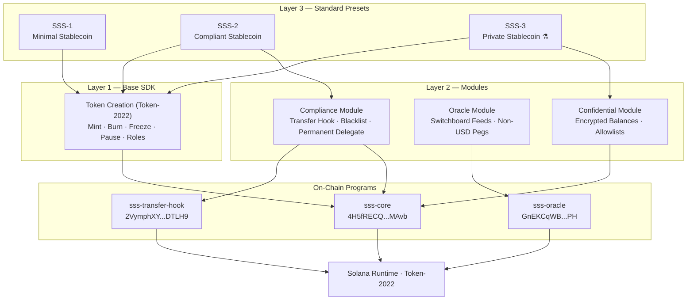
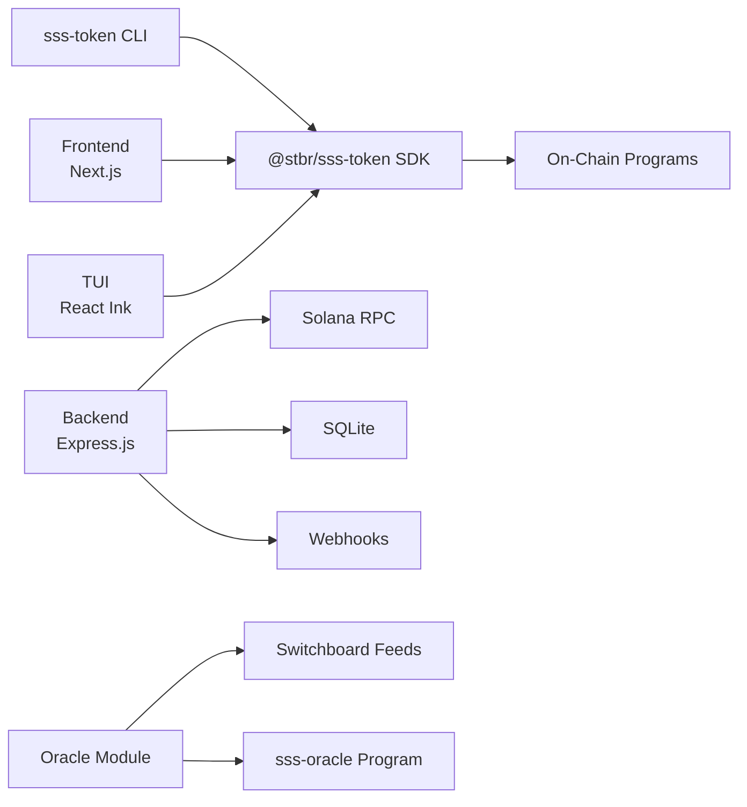

# Solana Stablecoin Standard (SSS)

[](LICENSE)
[](https://www.anchor-lang.com/)
[](https://spl.solana.com/token-2022)
[](https://nodejs.org/)

A modular SDK with opinionated presets for building stablecoins on Solana. Built on Token-2022 extensions with on-chain compliance, oracle integration, and production-ready tooling.

Built by [Superteam Brazil](https://superteam.fun).

---

## Table of Contents

- [Overview](#overview)
- [Architecture](#architecture)
- [Standards Comparison](#standards-comparison)
- [Quick Start](#quick-start)
- [Project Structure](#project-structure)
- [CLI Reference](#cli-reference)
- [SDK Reference](#sdk-reference)
- [Backend Services](#backend-services)
- [Bonus Features](#bonus-features)
- [On-Chain Programs](#on-chain-programs)
- [Testing](#testing)
- [Devnet Deployment](#devnet-deployment)
- [Contributing](#contributing)
- [License](#license)

---

## Overview

The Solana Stablecoin Standard (SSS) provides everything needed to launch, manage, and operate a stablecoin on Solana:

- **Three opinionated presets** -- SSS-1 (minimal), SSS-2 (compliant), and SSS-3 (private, experimental) -- so you can go from zero to a deployed token in minutes.
- **On-chain programs** written in Anchor/Rust for mint authority, role management, transfer hooks, blacklist enforcement, and oracle-based minting/redemption.
- **TypeScript SDK** for programmatic access to all on-chain operations.
- **CLI tool** (`sss-token`) for command-line token management.
- **Backend services** (Express.js) for mint/burn lifecycle, event indexing, compliance, and webhook notifications.
- **Frontend dashboard** (Next.js) for browser-based administration.
- **Terminal UI** (React Ink) for interactive terminal-based management.
- **Oracle module** for Switchboard price feeds, non-USD peg support, and depeg monitoring.
- **Confidential transfer module** (experimental) for privacy-preserving stablecoins with encrypted balances.

---

## Architecture



### Component Map



---

## Standards Comparison

| Feature                  | SSS-1 (Minimal)       | SSS-2 (Compliant)         | SSS-3 (Private) |
|--------------------------|-----------------------|---------------------------|-----------------|
| Mint Authority           | Yes                   | Yes                       | Yes |
| Freeze Authority         | Yes                   | Yes                       | Yes |
| Token Metadata           | Yes                   | Yes                       | Yes |
| Permanent Delegate       | --                    | Yes                       | -- |
| Transfer Hook            | --                    | Yes                       | -- (incompatible) |
| Blacklist Enforcement    | --                    | Yes (on-chain PDAs)       | -- |
| Confidential Transfers   | --                    | --                        | Yes |
| Allowlist (approval)     | --                    | --                        | Yes |
| Asset Seizure            | --                    | Yes (via permanent delegate) | -- |
| Pause / Unpause          | Yes                   | Yes                       | Yes |
| Multi-Minter with Caps   | Yes                   | Yes                       | Yes |
| Target Use Case          | DAO treasuries, internal tokens | Regulated USDC/USDT-class tokens | Privacy-preserving stablecoins |
| Status                   | Active                | Active                    | Experimental |

---

## Quick Start

### Prerequisites

- [Rust](https://rustup.rs/) (with `rustup`)
- [Solana CLI](https://docs.solana.com/cli/install-solana-cli-tools) (v1.18+)
- [Anchor CLI](https://www.anchor-lang.com/docs/installation) (v0.32.1)
- [Node.js](https://nodejs.org/) (>=18.0.0)
- [Yarn](https://yarnpkg.com/) or npm

### Install and Build

```bash
# Clone the repository
git clone https://github.com/solanabr/solana-stablecoin-standard.git
cd solana-stablecoin-standard

# Install all dependencies and build the SDK
npm run setup

# Build on-chain programs
anchor build

# Run tests
anchor test
```

### Create a Stablecoin (CLI)

```bash
# Initialize an SSS-1 stablecoin
sss-token init --preset sss-1

# Initialize an SSS-2 compliant stablecoin
sss-token init --preset sss-2

# Initialize an SSS-3 private stablecoin (experimental)
sss-token init --preset sss-3

# Mint tokens
sss-token mint <recipient> <amount>

# Check status
sss-token status
```

### Create a Stablecoin (SDK)

```typescript
import { SolanaStablecoin, Presets } from "@stbr/sss-core";

const stable = await SolanaStablecoin.create(connection, {
  preset: Presets.SSS_2,
  name: "My Stablecoin",
  symbol: "MYUSD",
  decimals: 6,
  authority: adminKeypair,
});

// Mint tokens
await stable.mint({ recipient, amount: 1_000_000, minter });

// Blacklist an address (SSS-2 only)
await stable.compliance.blacklistAdd(address, "Sanctions match");

// SSS-3: Private stablecoin with confidential transfers
import { ConfidentialMint } from "@stbr/sss-confidential";
```

---

## Project Structure

```
solana-stablecoin-standard/
|
|-- programs/                        # On-chain Anchor programs (Rust)
|   |-- sss-core/                    # Core mint, burn, freeze, roles, pause
|   |   +-- src/
|   |       |-- instructions/        # initialize, mint, burn, freeze, thaw,
|   |       |                        # pause, unpause, roles, minters, blacklist,
|   |       |                        # seize, authority transfer
|   |       |-- state.rs             # Config PDA, minter PDA, blacklist PDA
|   |       |-- errors.rs
|   |       |-- events.rs
|   |       +-- constants.rs
|   |-- sss-transfer-hook/           # Transfer hook for blacklist enforcement
|   +-- sss-oracle/                  # Oracle-based mint/redeem with price feeds
|       +-- src/
|           |-- instructions/        # initialize, update feed/params, mint/redeem,
|           |                        # withdraw fees
|           +-- utils/price.rs       # Price calculation helpers
|
|-- sdk/
|   +-- core/                        # @stbr/sss-token TypeScript SDK
|       +-- src/
|           |-- stablecoin.ts        # Main SolanaStablecoin class
|           |-- presets.ts           # SSS-1 and SSS-2 preset configs
|           |-- types.ts
|           |-- instructions/        # Instruction builders
|           +-- utils/               # PDA derivation, transfer hook helpers
|
|-- cli/                             # sss-token CLI (Commander.js)
|   +-- src/
|       |-- index.ts                 # Command registration
|       |-- commands/                # init, mint, burn, freeze, thaw, pause,
|       |                            # blacklist, seize, minters, roles, holders,
|       |                            # audit-log, tui, oracle
|       +-- utils/                   # Config, connection, formatting
|
|-- backend/                         # Express.js backend services
|   |-- docker-compose.yml
|   +-- src/
|       |-- index.ts                 # Server entrypoint
|       |-- config.ts
|       |-- routes/                  # operations, compliance, status
|       |-- services/                # mint-burn, event-listener, webhook, compliance
|       |-- middleware/              # request-id, error-handler
|       +-- utils/                   # logger (pino), db (SQLite)
|
|-- frontend/                        # Next.js admin dashboard
|   +-- src/
|       |-- app/                     # Pages: create, mint, freeze, compliance,
|       |                            # minters, roles, holders, transfer
|       |-- components/              # Header, Sidebar, StatCard, TxResult
|       +-- contexts/                # WalletProvider, StablecoinProvider
|
|-- tui/                             # React Ink terminal dashboard
|   +-- src/
|       |-- app.tsx
|       |-- screens/                 # Dashboard, Minters, Holders, Events, Compliance
|       |-- components/              # Header, StatusBar, OperationDialog
|       +-- hooks/                   # useStablecoinState, useEventLog, useAuditLog
|
|-- modules/
|   |-- oracle/                      # @stbr/sss-oracle-feeds
|   |   +-- src/
|   |       |-- index.ts
|   |       |-- price-feed.ts        # Price feed client
|   |       +-- known-feeds.ts       # Pre-configured Switchboard feed addresses
|   +-- confidential/              # @stbr/sss-confidential
|       +-- src/
|           |-- index.ts
|           |-- confidential-mint.ts  # Mint creation with CT extensions
|           |-- account-manager.ts    # Account setup, approval, deposit
|           +-- constants.ts          # SSS-3 constraints and extension config
|
|-- tests/                           # Integration tests
|   |-- sss-core.ts
|   +-- sss-oracle.ts
|
|-- scripts/                         # Deployment and utility scripts
|-- migrations/                      # Anchor migrations
|-- Anchor.toml                      # Anchor workspace config
|-- Cargo.toml                       # Rust workspace
+-- package.json                     # Root package (setup, build, lint)
```

---

## CLI Reference

The `sss-token` CLI provides complete token management from the command line.

### Token Lifecycle

| Command                            | Description                        |
|------------------------------------|------------------------------------|
| `sss-token init --preset sss-1`   | Create a minimal stablecoin        |
| `sss-token init --preset sss-2`   | Create a compliant stablecoin      |
| `sss-token init --preset sss-3`   | Create a private stablecoin (experimental) |
| `sss-token mint <recipient> <amount>` | Mint tokens to a recipient      |
| `sss-token burn <amount>`          | Burn tokens from your account      |
| `sss-token freeze <address>`       | Freeze a token account             |
| `sss-token thaw <address>`         | Thaw a frozen token account        |
| `sss-token pause`                  | Pause all token operations         |
| `sss-token unpause`               | Resume token operations            |

### Compliance (SSS-2)

| Command                                    | Description                          |
|--------------------------------------------|--------------------------------------|
| `sss-token blacklist add <address>`        | Add an address to the blacklist      |
| `sss-token blacklist remove <address>`     | Remove an address from the blacklist |
| `sss-token seize <address> <amount>`       | Seize tokens via permanent delegate  |

### Management

| Command                               | Description                           |
|---------------------------------------|---------------------------------------|
| `sss-token minters list`             | List all registered minters           |
| `sss-token minters add`              | Add a new minter with cap             |
| `sss-token minters remove`           | Remove a minter                       |
| `sss-token roles list`               | List current role assignments         |
| `sss-token roles update`             | Update role assignments               |
| `sss-token holders`                   | List all token holders                |
| `sss-token status`                    | Show token configuration and state    |
| `sss-token supply`                    | Show current token supply             |
| `sss-token audit-log`                | View the on-chain audit log           |

### Oracle

| Command                               | Description                           |
|---------------------------------------|---------------------------------------|
| `sss-token oracle init`              | Initialize oracle configuration       |
| `sss-token oracle status`            | Show oracle feed status               |
| `sss-token oracle mint`              | Mint tokens using oracle price feed   |
| `sss-token oracle redeem`            | Redeem tokens using oracle price feed |

### Interactive

| Command                               | Description                           |
|---------------------------------------|---------------------------------------|
| `sss-token tui`                       | Launch the terminal UI dashboard      |

---

## SDK Reference

### Installation

```bash
npm install @stbr/sss-token
```

### Core Class: `SolanaStablecoin`

```typescript
import { SolanaStablecoin, Presets } from "@stbr/sss-core";

// Create and initialize a new stablecoin
const stable = await SolanaStablecoin.create(connection, {
  preset: Presets.SSS_2,       // or Presets.SSS_1
  name: "My Stablecoin",
  symbol: "MYUSD",
  uri: "https://example.com/metadata.json",
  decimals: 6,
  authority: adminKeypair,
});
```

### Token Operations

```typescript
// Mint tokens
await stable.mint({ recipient: recipientPubkey, amount: 1_000_000, minter: minterKeypair });

// Burn tokens
await stable.burn({ amount: 500_000, owner: ownerKeypair });

// Freeze / Thaw
await stable.freeze({ account: targetPubkey, authority: freezeAuthority });
await stable.thaw({ account: targetPubkey, authority: freezeAuthority });

// Pause / Unpause
await stable.pause({ authority: adminKeypair });
await stable.unpause({ authority: adminKeypair });
```

### Minter Management

```typescript
// Add a minter with a cap
await stable.addMinter({ minter: minterPubkey, cap: 10_000_000, authority: adminKeypair });

// Remove a minter
await stable.removeMinter({ minter: minterPubkey, authority: adminKeypair });

// Update minter cap
await stable.updateMinter({ minter: minterPubkey, newCap: 20_000_000, authority: adminKeypair });
```

### Compliance (SSS-2)

```typescript
// Blacklist management
await stable.compliance.blacklistAdd(address, "Sanctions match");
await stable.compliance.blacklistRemove(address);

// Seize tokens from a blacklisted address
await stable.seize({ target: targetPubkey, amount: 100_000, authority: adminKeypair });
```

### Authority Management

```typescript
// Transfer authority (two-step process)
await stable.transferAuthority({ newAuthority: newAdminPubkey, authority: currentAdmin });
await stable.acceptAuthority({ authority: newAdminKeypair });
await stable.cancelAuthorityTransfer({ authority: currentAdmin });

// Update roles
await stable.updateRoles({ roles: updatedRoles, authority: adminKeypair });
```

### Presets

```typescript
import { Presets } from "@stbr/sss-core";

// SSS-1: Minimal -- metadata only
Presets.SSS_1
// { enableMetadata: true, enablePermanentDelegate: false, enableTransferHook: false }

// SSS-2: Compliant -- metadata + permanent delegate + transfer hook
Presets.SSS_2
// { enableMetadata: true, enablePermanentDelegate: true, enableTransferHook: true }

// SSS-3: Private -- metadata + confidential transfers (experimental)
Presets.SSS_3
// { enableMetadata: true, enablePermanentDelegate: false, enableTransferHook: false, enableConfidentialTransfer: true }
```

---

## Backend Services

The backend provides an Express.js server for production stablecoin operations.

### Services

| Service          | Description                                                     |
|------------------|-----------------------------------------------------------------|
| Mint/Burn        | REST endpoints for token minting and burning                    |
| Event Listener   | Polls Solana RPC for on-chain events and indexes them locally   |
| Compliance       | Blacklist management and enforcement queries                    |
| Webhook          | Sends notifications on token events to configured endpoints     |
| Audit Database   | SQLite-backed audit log of all operations                       |

### API Routes

| Route              | Description                        |
|--------------------|------------------------------------|
| `/operations/*`    | Mint, burn, freeze, thaw endpoints |
| `/compliance/*`    | Blacklist and compliance queries   |
| `/status/*`        | Token status and health checks     |

### Running

```bash
# Development
cd backend
npm run dev

# Production (Docker)
cd backend
docker compose up
```

### Environment Variables

| Variable            | Default                          | Description                  |
|---------------------|----------------------------------|------------------------------|
| `RPC_URL`           | `https://api.devnet.solana.com`  | Solana RPC endpoint          |
| `PROGRAM_ID`        | --                               | SSS Core program ID          |
| `MINT`              | --                               | Token mint address           |
| `KEYPAIR_PATH`      | `~/.config/solana/id.json`       | Path to authority keypair    |
| `PORT`              | `3000`                           | Server port                  |
| `LOG_LEVEL`         | `info`                           | Pino log level               |
| `POLL_INTERVAL_MS`  | `5000`                           | Event polling interval (ms)  |
| `DB_PATH`           | `sss.db`                         | SQLite database path         |

---

## Bonus Features

### Frontend Dashboard

A Next.js admin dashboard with Solana wallet integration for browser-based stablecoin management.

**Features:**
- Token creation (SSS-1 / SSS-2)
- Mint and transfer operations
- Freeze / thaw account management
- Minter and role management
- Compliance and blacklist management
- Token holder overview
- Real-time transaction results

```bash
npm run dev:frontend
```

### Terminal UI (TUI)

A React Ink terminal dashboard for interactive stablecoin management directly in the terminal.

**Screens:**
- Dashboard -- token status, supply, and configuration overview
- Minters -- view and manage minters
- Holders -- browse token holders
- Events -- live event log
- Compliance -- blacklist management

```bash
sss-token tui
```

### Oracle Module

The oracle module (`@stbr/sss-oracle-feeds`) provides Switchboard-based price feeds for non-USD stablecoin pegs and depeg monitoring.

**On-chain program features:**
- Initialize oracle configuration with Switchboard feed addresses
- Update oracle parameters (price bounds, fees, staleness thresholds)
- Mint tokens at oracle-determined exchange rates
- Redeem tokens at oracle-determined exchange rates
- Fee collection and withdrawal

**Off-chain module features:**
- Price feed client with known Switchboard feed addresses
- Depeg monitoring and alerting

```bash
# Initialize oracle via CLI
sss-token oracle init

# Check oracle status
sss-token oracle status

# Mint using oracle price
sss-token oracle mint

# Redeem using oracle price
sss-token oracle redeem
```

### SSS-3: Private Stablecoin (Experimental)

SSS-3 extends SSS-1 with confidential transfers and scoped allowlists for privacy-preserving stablecoins. Transfer amounts and balances are encrypted on-chain while addresses remain public.

> **Status:** The ZK ElGamal Proof Program required for confidential transfers is currently disabled on devnet and mainnet. Use a local test validator for testing.

**Module:** `@stbr/sss-confidential` (`modules/confidential/`)

See [SSS-3.md](./SSS-3.md) for the full specification.

---

## On-Chain Programs

All programs are built with Anchor 0.32.1 and deployed to devnet.

| Program              | Program ID                                        |
|----------------------|---------------------------------------------------|
| `sss-core`           | `4H5fRECQ4HLMGhabHEkzAya34pVZn8WBMqUw5TyhMAvb`  |
| `sss-transfer-hook`  | `2VymphXYSrCV4qtS3FyiGmNQvcNrEXNUyRUh9MhDTLH9`  |
| `sss-oracle`         | `GnEKCqWBDCTzLHrCTiRT6Mi1a37PHSsAoFBowLKPT2PH`  |

### sss-core

The core program handles token creation, minting, burning, freezing, pausing, role management, blacklisting, and asset seizure. It uses Token-2022 extensions including metadata, permanent delegate, and transfer hook.

**Instructions:** `initialize`, `mint_tokens`, `burn_tokens`, `freeze_account`, `thaw_account`, `pause`, `unpause`, `add_minter`, `remove_minter`, `update_minter`, `update_roles`, `transfer_authority`, `accept_authority`, `cancel_authority_transfer`, `blacklist_address`, `remove_from_blacklist`, `seize`

### sss-transfer-hook

Enforces blacklist compliance on every token transfer. When a transfer hook is enabled (SSS-2), this program checks the sender and recipient against on-chain blacklist PDAs and rejects transfers involving blacklisted addresses.

### sss-oracle

Integrates Switchboard price feeds for oracle-based minting and redemption. Supports non-USD pegs, configurable price bounds, staleness checks, and fee collection.

**Instructions:** `initialize_oracle`, `update_oracle_feed`, `update_oracle_params`, `mint_with_oracle`, `redeem_with_oracle`, `withdraw_fees`

---

## Testing

```bash
# Run all integration tests
anchor test

# Run tests against localnet
anchor test --skip-deploy

# Run oracle module unit tests
cd modules/oracle
npm test
```

The test suite in `tests/` covers:
- `sss-core.ts` -- Core token lifecycle, minter management, compliance operations
- `sss-oracle.ts` -- Oracle initialization, price feed updates, oracle-based mint/redeem

---

## Devnet Deployment

The programs are deployed to Solana devnet with the addresses listed in `Anchor.toml`.

```bash
# Configure for devnet
solana config set --url devnet

# Build programs
anchor build

# Deploy to devnet
anchor deploy

# Verify deployment
solana program show 4H5fRECQ4HLMGhabHEkzAya34pVZn8WBMqUw5TyhMAvb
solana program show 2VymphXYSrCV4qtS3FyiGmNQvcNrEXNUyRUh9MhDTLH9
solana program show GnEKCqWBDCTzLHrCTiRT6Mi1a37PHSsAoFBowLKPT2PH
```

---

## Contributing

Contributions are welcome. Please follow these guidelines:

1. Fork the repository and create a feature branch from `main`.
2. Ensure all existing tests pass (`anchor test`).
3. Add tests for any new functionality.
4. Follow the existing code style. Run `npm run lint` before submitting.
5. Write clear commit messages.
6. Open a pull request with a description of your changes.

### Development Setup

```bash
# Full setup
npm run setup

# Build everything
npm run build:all

# Lint
npm run lint

# Fix lint issues
npm run lint:fix
```

---

## License

This project is licensed under the [MIT License](LICENSE).

Copyright (c) 2026 Superteam Brazil.
