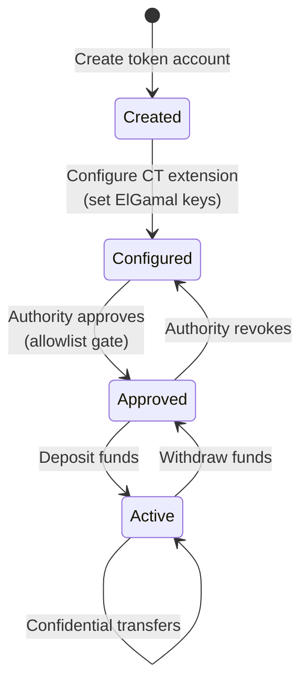
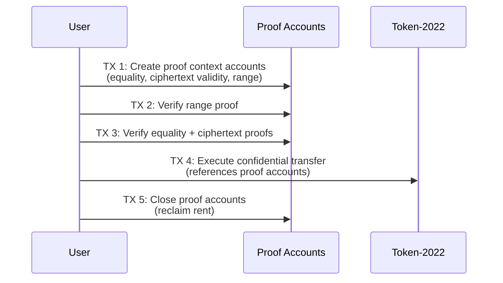

# Solana Stablecoin Standard -- TypeScript SDK

This document covers the three TypeScript packages that compose the Solana Stablecoin Standard SDK. Together they provide everything needed to create, manage, and monitor stablecoins on Solana using the Token-2022 program.

| Package | Path | Description |
|---------|------|-------------|
| `@stbr/sss-token` | `sdk/core/` | Core SDK for SSS-1 and SSS-2 stablecoin operations |
| `@stbr/sss-oracle` | `sdk/oracle/` | On-chain oracle integration (Switchboard price feeds) |
| `@stbr/sss-oracle-feeds` | `modules/oracle/` | Off-chain price feeds and depeg monitoring |
| `@stbr/sss-confidential` | `modules/confidential/` | SSS-3 confidential transfer mint creation and account management (experimental) |

---

## Table of Contents

1. [Core SDK (@stbr/sss-token)](#core-sdk)
   - [Installation](#installation)
   - [Presets](#presets)
   - [Creating a Stablecoin](#creating-a-stablecoin)
   - [Loading an Existing Stablecoin](#loading-an-existing-stablecoin)
   - [Token Operations](#token-operations)
   - [Minter Management](#minter-management)
   - [Role Management](#role-management)
   - [Authority Transfer](#authority-transfer)
   - [SSS-2 Compliance](#sss-2-compliance)
   - [PDA Utilities](#pda-utilities)
   - [Transfer Hook Utilities](#transfer-hook-utilities)
   - [Types](#types)
2. [Oracle SDK (@stbr/sss-oracle)](#oracle-sdk)
   - [Initialization](#oracle-initialization)
   - [Mint and Redeem](#mint-and-redeem-with-oracle)
   - [Oracle Management](#oracle-management)
   - [Price Utilities](#price-utilities)
   - [PDA Utilities (Oracle)](#pda-utilities-oracle)
3. [Oracle Feeds Module (@stbr/sss-oracle-feeds)](#oracle-feeds-module)
   - [Known Feeds](#known-feeds)
   - [OraclePriceFeed](#oraclepricefeed)
   - [DepegMonitor](#depegmonitor)
4. [Confidential Module (@stbr/sss-confidential)](#confidential-module)
   - [Mint Creation](#confidential-mint-creation)
   - [Account Management](#confidential-account-management)
   - [Constants](#sss-3-constants)

---

## Core SDK

**Package:** `@stbr/sss-token`
**Dependencies:** `@coral-xyz/anchor`, `@solana/web3.js`, `@solana/spl-token`

### Installation

```bash
npm install @stbr/sss-token
```

### Presets

The SDK ships with two preset configurations that map to the SSS-1 and SSS-2 standards.

```typescript
import { Presets } from "@stbr/sss-token";
```

**`Presets.SSS_1` -- Minimal Stablecoin**

Mint authority, freeze authority, and metadata. Suitable for internal tokens, DAO treasuries, and ecosystem settlement.

```typescript
{
  enableMetadata: true,
  enablePermanentDelegate: false,
  enableTransferHook: false,
  defaultAccountFrozen: false,
}
```

**`Presets.SSS_2` -- Compliant Stablecoin**

SSS-1 plus permanent delegate, transfer hook, and blacklist enforcement. Suitable for regulated stablecoins with on-chain compliance (USDC/USDT-class tokens).

```typescript
{
  enableMetadata: true,
  enablePermanentDelegate: true,
  enableTransferHook: true,
  defaultAccountFrozen: false,
}
```

**`Presets.SSS_3` -- Private Stablecoin (Experimental)**

SSS-1 plus confidential transfers and scoped allowlists. For privacy-preserving stablecoins with encrypted balances and transfer amounts. Transfer hooks are incompatible with confidential transfers, so SSS-3 uses an approval-authority allowlist pattern instead.

> **Note:** The ZK ElGamal Proof Program is currently disabled on devnet/mainnet. Use a local test validator for testing.

```typescript
{
  enableMetadata: true,
  enablePermanentDelegate: false,
  enableTransferHook: false,
  defaultAccountFrozen: false,
  enableConfidentialTransfer: true,
}
```

### Creating a Stablecoin

Use `SolanaStablecoin.create()` to initialize a new stablecoin. This creates the mint and config PDA on-chain.

```typescript
import { SolanaStablecoin, Presets } from "@stbr/sss-token";
import { Connection, Keypair } from "@solana/web3.js";
import { Program } from "@coral-xyz/anchor";

const connection = new Connection("https://api.mainnet-beta.solana.com");
const authority = Keypair.generate();

// SSS-1: Simple stablecoin
const { stablecoin, mintKeypair, txSig } = await SolanaStablecoin.create({
  program,        // Program<SssCore>
  connection,
  preset: Presets.SSS_1,
  name: "My Stablecoin",
  symbol: "MYUSD",
  uri: "https://example.com/metadata.json",
  decimals: 6,
  authority,
});

// SSS-2: Compliant stablecoin with transfer hook
const { stablecoin: sss2, mintKeypair: mint2, txSig: sig2, hookTxSig } =
  await SolanaStablecoin.create({
    program,
    connection,
    preset: Presets.SSS_2,
    name: "Compliant Stable",
    symbol: "CUSD",
    uri: "https://example.com/metadata.json",
    decimals: 6,
    authority,
    transferHookProgramId: hookProgramId,
    hookProgram, // Program<SssTransferHook>
  });

// Custom configuration (no preset)
const { stablecoin: custom } = await SolanaStablecoin.create({
  program,
  connection,
  name: "Custom Stable",
  symbol: "XUSD",
  uri: "https://example.com/metadata.json",
  decimals: 6,
  authority,
  enableMetadata: true,
  enablePermanentDelegate: true,
  enableTransferHook: false,
  defaultAccountFrozen: false,
});
```

**`CreateParams` interface:**

| Parameter | Type | Required | Description |
|-----------|------|----------|-------------|
| `program` | `Program<SssCore>` | Yes | Anchor program instance |
| `connection` | `Connection` | Yes | Solana RPC connection |
| `name` | `string` | Yes | Token name |
| `symbol` | `string` | Yes | Token symbol |
| `uri` | `string` | Yes | Metadata URI |
| `decimals` | `number` | Yes | Token decimals |
| `authority` | `Keypair` | Yes | Admin keypair |
| `preset` | `PresetConfig` | No | SSS_1 or SSS_2 preset |
| `enableMetadata` | `boolean` | No | Enable token metadata extension |
| `enablePermanentDelegate` | `boolean` | No | Enable permanent delegate extension |
| `enableTransferHook` | `boolean` | No | Enable transfer hook extension |
| `defaultAccountFrozen` | `boolean` | No | Freeze new token accounts by default |
| `transferHookProgramId` | `PublicKey` | No | Transfer hook program ID (SSS-2) |
| `hookProgram` | `Program<SssTransferHook>` | No | Transfer hook program instance (SSS-2) |

**Return value:**

```typescript
{
  stablecoin: SolanaStablecoin;  // SDK instance
  mintKeypair: Keypair;          // Generated mint keypair
  txSig: string;                 // Initialize transaction signature
  hookTxSig?: string;            // Transfer hook init signature (SSS-2 only)
}
```

### Loading an Existing Stablecoin

```typescript
const stablecoin = await SolanaStablecoin.load({
  program,
  connection,
  mint: existingMintPublicKey,
});
```

The `load` method verifies that the config PDA exists on-chain before returning.

**Instance properties:**

| Property | Type | Description |
|----------|------|-------------|
| `program` | `Program<SssCore>` | Anchor program instance |
| `connection` | `Connection` | Solana RPC connection |
| `mintAddress` | `PublicKey` | Mint public key |
| `configPda` | `PublicKey` | Config PDA address |
| `configBump` | `number` | Config PDA bump seed |

### Token Operations

#### Querying State

```typescript
// Fetch on-chain config
const config = await stablecoin.getConfig();
console.log("Authority:", config.authority.toBase58());
console.log("Is paused:", config.isPaused);
console.log("Total minters:", config.totalMinters);

// Get total supply
const supply = await stablecoin.getTotalSupply();
console.log("Supply:", supply.toString());

// Get minter info
const minterInfo = await stablecoin.getMinterInfo(minterPublicKey);
console.log("Quota:", minterInfo.quota.toString());
console.log("Minted:", minterInfo.minted.toString());
console.log("Active:", minterInfo.active);
console.log("Unlimited:", minterInfo.unlimited);

// Derive an associated token account
const ata = stablecoin.getAta(ownerPublicKey);
```

#### Minting

```typescript
import { BN } from "@coral-xyz/anchor";

const txSig = await stablecoin.mint({
  recipient: userPublicKey,
  amount: new BN(1_000_000), // 1.0 tokens (6 decimals)
  minter: minterPublicKey,   // Must be an authorized minter (signer)
});
```

#### Burning

```typescript
const txSig = await stablecoin.burn({
  amount: new BN(500_000),
  burner: burnerPublicKey,         // Must have burner role (signer)
  tokenAccount: userTokenAccount,  // Token account to burn from
});
```

#### Freezing and Thawing

```typescript
// Freeze a token account
const txSig = await stablecoin.freeze(tokenAccount, freezerPublicKey);

// Thaw a frozen token account
const txSig = await stablecoin.thaw(tokenAccount, freezerPublicKey);
```

#### Pause and Unpause

```typescript
// Pause all operations on the stablecoin
const txSig = await stablecoin.pause(pauserPublicKey);

// Resume operations
const txSig = await stablecoin.unpause(pauserPublicKey);
```

### Minter Management

Minters are authorized addresses that can mint new tokens up to a configured quota.

```typescript
import { BN } from "@coral-xyz/anchor";

// Add a new minter with a 1,000,000 token quota
await stablecoin.addMinter(
  authorityPublicKey,
  minterPublicKey,
  new BN(1_000_000_000_000), // quota in base units
  false                       // unlimited = false
);

// Add an unlimited minter (no quota cap)
await stablecoin.addMinter(
  authorityPublicKey,
  minterPublicKey,
  new BN(0),
  true // unlimited = true
);

// Update minter quota and status
await stablecoin.updateMinter(
  authorityPublicKey,
  minterPublicKey,
  new BN(2_000_000_000_000), // new quota
  true,                       // active
  false                       // unlimited
);

// Remove a minter
await stablecoin.removeMinter(authorityPublicKey, minterPublicKey);
```

### Role Management

The stablecoin config stores dedicated role addresses for pauser, burner, freezer, blacklister, and seizer. Update any subset of roles in a single transaction.

```typescript
await stablecoin.updateRoles(authorityPublicKey, {
  pauser: newPauserPublicKey,
  freezer: newFreezerPublicKey,
  blacklister: newBlacklisterPublicKey,
  seizer: newSeizerPublicKey,
  burner: newBurnerPublicKey,
});

// Partial update -- only change the pauser
await stablecoin.updateRoles(authorityPublicKey, {
  pauser: newPauserPublicKey,
});
```

**`UpdateRolesParams` fields:**

| Field | Type | Description |
|-------|------|-------------|
| `pauser` | `PublicKey \| null` | New pauser address |
| `burner` | `PublicKey \| null` | New burner address |
| `freezer` | `PublicKey \| null` | New freezer address |
| `blacklister` | `PublicKey \| null` | New blacklister address (SSS-2) |
| `seizer` | `PublicKey \| null` | New seizer address (SSS-2) |

All fields are optional. Only provided fields are updated.

### Authority Transfer

Authority transfer follows a two-step process for safety: the current authority initiates the transfer, then the new authority must accept it.

```typescript
// Step 1: Current authority initiates transfer
await stablecoin.transferAuthority(currentAuthority, newAuthorityPublicKey);

// Step 2: New authority accepts
await stablecoin.acceptAuthority(newAuthorityPublicKey);

// Cancel a pending transfer (only current authority)
await stablecoin.cancelAuthorityTransfer(currentAuthority);
```

### SSS-2 Compliance

The `compliance` namespace provides blacklist enforcement and token seizure operations. These require SSS-2 configuration (permanent delegate and transfer hook enabled).

#### Blacklist

```typescript
// Add an address to the blacklist
await stablecoin.compliance.blacklistAdd(
  addressToBlacklist,
  blacklisterPublicKey  // Must have blacklister role (signer)
);

// Remove from blacklist
await stablecoin.compliance.blacklistRemove(
  addressToRemove,
  blacklisterPublicKey
);

// Check if an address is blacklisted
const isBlocked = await stablecoin.compliance.isBlacklisted(suspectAddress);

// Fetch the full blacklist entry (returns null if not blacklisted)
const entry = await stablecoin.getBlacklistEntry(suspectAddress);
```

#### Seize Tokens

Seize transfers tokens from a blacklisted account to a treasury using the permanent delegate. For SSS-2 mints with transfer hooks, the SDK automatically resolves the required remaining accounts.

```typescript
import { BN } from "@coral-xyz/anchor";

await stablecoin.compliance.seize(
  fromOwnerPublicKey,       // Blacklisted account owner
  treasuryOwnerPublicKey,   // Treasury account owner
  new BN(1_000_000),        // Amount to seize
  seizerPublicKey,          // Must have seizer role (signer)
  hookProgramId             // Transfer hook program ID (optional, for SSS-2)
);

// With explicit remaining accounts (advanced usage)
await stablecoin.compliance.seize(
  fromOwner,
  treasury,
  amount,
  seizer,
  undefined,
  remainingAccounts         // AccountMeta[]
);
```

### PDA Utilities

Derive program-derived addresses without an SDK instance.

```typescript
import {
  findConfigPda,
  findMinterPda,
  findBlacklistPda,
  findExtraAccountMetaListPda,
} from "@stbr/sss-token";

// Config PDA: seeds = ["stablecoin_config", mint]
const [configPda, configBump] = findConfigPda(mintPublicKey, programId);

// Minter PDA: seeds = ["minter_info", config, minter]
const [minterPda, minterBump] = findMinterPda(configPda, minterPublicKey, programId);

// Blacklist PDA: seeds = ["blacklist_seed", config, address]
const [blacklistPda, blacklistBump] = findBlacklistPda(configPda, addressPublicKey, programId);

// Extra account meta list PDA: seeds = ["extra-account-metas", mint]
const [metaListPda, metaListBump] = findExtraAccountMetaListPda(
  mintPublicKey,
  transferHookProgramId
);
```

### Transfer Hook Utilities

Build the remaining accounts array required for `transfer_checked` CPI calls on SSS-2 mints. This is used internally by `compliance.seize()` but is available for custom integrations.

```typescript
import { getTransferHookRemainingAccounts } from "@stbr/sss-token";

const remainingAccounts = getTransferHookRemainingAccounts(
  mintPublicKey,
  configPda,
  sourceOwnerPublicKey,
  destOwnerPublicKey,
  hookProgramId,
  coreProgramId
);
// Returns AccountMeta[]:
//   [0] Extra account meta list PDA
//   [1] SSS-core program ID
//   [2] Config PDA
//   [3] Source blacklist PDA
//   [4] Destination blacklist PDA
//   [5] Hook program ID
```

### Types

**`StablecoinConfig`** -- On-chain config account.

```typescript
interface StablecoinConfig {
  authority: PublicKey;
  mint: PublicKey;
  pauser: PublicKey;
  burner: PublicKey;
  freezer: PublicKey;
  blacklister: PublicKey;
  seizer: PublicKey;
  pendingAuthority: PublicKey | null;
  decimals: number;
  isPaused: boolean;
  hasMetadata: boolean;
  totalMinters: number;
  enablePermanentDelegate: boolean;
  enableTransferHook: boolean;
  defaultAccountFrozen: boolean;
  bump: number;
}
```

**`MinterInfo`** -- On-chain minter account.

```typescript
interface MinterInfo {
  config: PublicKey;
  minter: PublicKey;
  quota: BN;
  minted: BN;
  active: boolean;
  unlimited: boolean;
  bump: number;
}
```

**`BlacklistEntry`** -- On-chain blacklist account.

```typescript
interface BlacklistEntry {
  config: PublicKey;
  address: PublicKey;
  bump: number;
}
```

**`PresetConfig`** -- Preset configuration for stablecoin creation.

```typescript
interface PresetConfig {
  enableMetadata: boolean;
  enablePermanentDelegate: boolean;
  enableTransferHook: boolean;
  defaultAccountFrozen: boolean;
  enableConfidentialTransfer?: boolean;
}
```

---

## Oracle SDK

**Package:** `@stbr/sss-oracle`
**Dependencies:** `@coral-xyz/anchor`, `@solana/web3.js`, `@solana/spl-token`, `@stbr/sss-token`

The oracle SDK integrates Switchboard on-demand price feeds with the core stablecoin, enabling collateral-backed minting and redemption for non-USD stablecoins.

**Program ID:** `GnEKCqWBDCTzLHrCTiRT6Mi1a37PHSsAoFBowLKPT2PH`

### Oracle Initialization

```typescript
import { SolanaStablecoinOracle } from "@stbr/sss-oracle";

// Load an existing oracle instance
const oracle = await SolanaStablecoinOracle.load({
  program,           // Anchor program instance for sss-oracle
  connection,
  stablecoinMint,    // PublicKey of the stablecoin mint
});

// Initialize a new oracle configuration
await oracle.initializeOracle({
  stablecoinMint,
  collateralMint,                                // e.g., USDC mint
  oracleFeed: switchboardFeedPublicKey,           // Switchboard pull feed
  sssCoreProgram: coreProgramId,                  // sss-core program ID
  maxStaleSlots: 100,                             // Max feed staleness
  minSamples: 1,                                  // Min oracle responses
  spreadBps: 30,                                  // 0.30% spread
  stablecoinDecimals: 6,
  collateralDecimals: 6,
  authority: authorityPublicKey,
});
```

**`OracleConfig`** -- On-chain oracle config account:

```typescript
interface OracleConfig {
  authority: PublicKey;
  stablecoinMint: PublicKey;
  collateralMint: PublicKey;
  oracleFeed: PublicKey;
  vault: PublicKey;
  sssCoreProgram: PublicKey;
  maxStaleSlots: number;
  minSamples: number;
  stablecoinDecimals: number;
  collateralDecimals: number;
  spreadBps: number;
  isActive: boolean;
  bump: number;
  vaultBump: number;
}
```

### Mint and Redeem with Oracle

Mint stablecoins by depositing collateral at the oracle price, or redeem stablecoins to receive collateral back. Both operations read the Switchboard feed on-chain and apply the configured spread.

```typescript
import { BN } from "@coral-xyz/anchor";

// Mint 1000 stablecoins, willing to pay up to 1100 USDC in collateral
const mintTx = await oracle.mintWithOracle({
  user: userPublicKey,                // User wallet (signer)
  stablecoinAmount: new BN(1_000_000_000),  // 1000 tokens (6 decimals)
  maxCollateral: new BN(1_100_000_000),     // Slippage protection
});

// Redeem 500 stablecoins, expect at least 480 USDC back
const redeemTx = await oracle.redeemWithOracle({
  user: userPublicKey,
  stablecoinAmount: new BN(500_000_000),
  minCollateral: new BN(480_000_000),       // Slippage protection
});
```

The SDK automatically resolves the following accounts from the on-chain config:
- Oracle feed address
- Collateral vault and vault authority PDAs
- SSS-core config and minter info PDAs
- User collateral (SPL Token) and stablecoin (Token-2022) ATAs

### Oracle Management

```typescript
// Read current config
const config = await oracle.getConfig();

// Update the Switchboard feed address
await oracle.updateFeed(authorityPublicKey, newFeedPublicKey);

// Update oracle parameters (all fields optional)
await oracle.updateParams(authorityPublicKey, {
  maxStaleSlots: 50,
  minSamples: 2,
  spreadBps: 50,       // 0.50%
  isActive: false,     // Disable oracle
});

// Withdraw accumulated fees from the collateral vault
await oracle.withdrawFees(
  authorityPublicKey,
  new BN(100_000_000),       // Amount to withdraw
  destinationTokenAccount    // Destination SPL token account
);
```

### Price Utilities

Standalone functions that mirror the on-chain collateral calculations. Use these for UI previews and pre-flight validation.

```typescript
import {
  calculateCollateralForMint,
  calculateCollateralForRedeem,
} from "@stbr/sss-oracle";
import { BN } from "@coral-xyz/anchor";

const stablecoinAmount = new BN(1_000_000); // 1.0 stablecoin
const oraclePrice = new BN("1080000000000000000"); // 1.08 with 18 decimals
const stablecoinDecimals = 6;
const collateralDecimals = 6;
const spreadBps = 30; // 0.30%

// How much collateral to mint 1.0 stablecoin?
const collateralNeeded = calculateCollateralForMint(
  stablecoinAmount,
  oraclePrice,
  stablecoinDecimals,
  collateralDecimals,
  spreadBps
);
// Result is rounded up to protect the protocol.

// How much collateral returned when redeeming 1.0 stablecoin?
const collateralReturned = calculateCollateralForRedeem(
  stablecoinAmount,
  oraclePrice,
  stablecoinDecimals,
  collateralDecimals,
  spreadBps
);
// Result reflects spread deduction (user receives less).
```

**Calculation logic:**

- Oracle prices use Switchboard's 18-decimal fixed-point format.
- Mint: `collateral = (stablecoinAmount * oraclePrice / 10^18) * (10000 + spreadBps) / 10000 + 1`
- Redeem: `collateral = (stablecoinAmount * oraclePrice / 10^18) * (10000 - spreadBps) / 10000`
- Decimal adjustment is applied when stablecoin and collateral decimals differ.

### PDA Utilities (Oracle)

```typescript
import { findOracleConfigPda, findVaultAuthorityPda } from "@stbr/sss-oracle";

// Oracle config PDA: seeds = ["oracle_config", stablecoinMint]
const [oracleConfigPda, bump] = findOracleConfigPda(stablecoinMint, oracleProgramId);

// Vault authority PDA: seeds = ["vault_authority", oracleConfig]
const [vaultAuthority, vaultBump] = findVaultAuthorityPda(oracleConfigPda, oracleProgramId);
```

---

## Oracle Feeds Module

**Package:** `@stbr/sss-oracle-feeds`
**Dependencies:** `@solana/web3.js`, `bn.js`

This package provides off-chain tooling for reading Switchboard price feeds and monitoring stablecoin peg stability. It has no dependency on Anchor and can run in any Node.js or browser environment with an RPC connection.

### Known Feeds

A catalog of Switchboard on-demand pull feed addresses for common currency pairs (mainnet).

```typescript
import {
  KNOWN_FEEDS,
  getFeedByPair,
  getFeedByBaseCurrency,
  listAvailablePairs,
} from "@stbr/sss-oracle-feeds";

// List all available pairs
const pairs = listAvailablePairs();
// ["EUR/USD", "GBP/USD", "BRL/USD", "JPY/USD", "MXN/USD", "SOL/USD", "BTC/USD", "ETH/USD"]

// Look up by pair
const eurFeed = getFeedByPair("EUR/USD");
console.log(eurFeed.feedAddress.toBase58());  // AdtRGGhmqvom3Jemp5YNrxd9q9unX36BZk1pujkkXijL
console.log(eurFeed.recommendedMaxStaleSlots); // 100

// Look up by base currency
const btcFeed = getFeedByBaseCurrency("BTC");

// Direct access
const solFeed = KNOWN_FEEDS["SOL/USD"];
```

**Available feeds:**

| Pair | Feed Address | Max Stale Slots |
|------|-------------|-----------------|
| EUR/USD | `AdtRGGhmqvom3Jemp5YNrxd9q9unX36BZk1pujkkXijL` | 100 |
| GBP/USD | `Bz1kTkHqxUaSjPMuXvhjDi5RNxBXavnAGFQJXj5t3vpV` | 100 |
| BRL/USD | `7oMJ5pMgiMBnBjvBcG4VJ2KVCYKp6Ywi3gJ5WxEVqQV` | 100 |
| JPY/USD | `GcXSdVrsBETFMk5x3H6TDNJfNeEJ5GaRZmEKzMHBGSfE` | 100 |
| MXN/USD | `DGqFyRJnREDfzrJDCZN3RC9TRLLKhRMqvJ6oP34g7qVs` | 100 |
| SOL/USD | `GvDMxPzN1sCj7L26YDK2HnMRXEQmQ2aemov8YBtPS7vR` | 50 |
| BTC/USD | `8SXvChNYFhRq4EZuZvnhjrB3jJRQCv4k3P4W6hesH3Ee` | 50 |
| ETH/USD | `HNStfhaLnqwF2ZtJUizaA9uHDAVB976r2AgTUx9LrdEo` | 50 |

All feeds use 18-decimal Switchboard precision and a recommended minimum of 1 sample.

**`FeedInfo` interface:**

```typescript
interface FeedInfo {
  name: string;                    // Human-readable name
  feedAddress: PublicKey;          // Switchboard pull feed address
  pair: string;                   // Currency pair (e.g., "EUR/USD")
  baseCurrency: string;           // ISO code of base currency
  quoteCurrency: string;          // ISO code of quote currency
  decimals: number;               // Price decimals (18)
  recommendedMaxStaleSlots: number;
  recommendedMinSamples: number;
}
```

### OraclePriceFeed

Fetch and parse prices from Switchboard on-demand pull feeds. This is a lightweight off-chain reader for UI display, pre-flight checks, and monitoring. The on-chain program reads feeds directly during execution.

```typescript
import { OraclePriceFeed, KNOWN_FEEDS } from "@stbr/sss-oracle-feeds";
import { Connection } from "@solana/web3.js";

const connection = new Connection("https://api.mainnet-beta.solana.com");

const feed = new OraclePriceFeed(connection, {
  feedAddress: KNOWN_FEEDS["EUR/USD"].feedAddress,
  maxStaleSlots: 100,   // Optional, default: 100
  minSamples: 1,        // Optional, default: 1
});

// Fetch current price
const priceData = await feed.fetchPrice();
console.log("Price:", priceData.price);           // e.g., 1.08
console.log("Raw mantissa:", priceData.rawMantissa.toString()); // i128 with 18 decimals
console.log("Slot:", priceData.slot);
console.log("Timestamp:", priceData.timestamp);

// Check staleness
const stale = await feed.isStale();
if (stale) {
  console.log("Feed is stale -- price data may be outdated");
}

// Pre-flight collateral calculation
const collateral = feed.calculateCollateralForMint(
  new BN(1_000_000),                // 1.0 stablecoin (6 decimals)
  priceData.rawMantissa,             // Oracle price
  6,                                 // Stablecoin decimals
  6,                                 // Collateral decimals
  30                                 // Spread in basis points
);

const redeemCollateral = feed.calculateCollateralForRedeem(
  new BN(1_000_000),
  priceData.rawMantissa,
  6, 6, 30
);
```

**`PriceData` interface:**

```typescript
interface PriceData {
  rawMantissa: BN;   // Raw i128 mantissa with 18 decimal places
  price: number;     // Human-readable price
  slot: number;      // Slot at which the price was fetched
  timestamp: Date;   // Timestamp of the fetch
}
```

### DepegMonitor

Watch a Switchboard feed and receive alerts when the price deviates beyond configurable thresholds. The monitor polls at a configurable interval and emits events for price updates, depeg alerts, errors, and staleness.

```typescript
import { DepegMonitor, KNOWN_FEEDS } from "@stbr/sss-oracle-feeds";
import { Connection } from "@solana/web3.js";

const connection = new Connection("https://api.mainnet-beta.solana.com");

const monitor = new DepegMonitor(connection, {
  pair: "EUR/USD",
  feedConfig: { feedAddress: KNOWN_FEEDS["EUR/USD"].feedAddress },
  expectedPrice: 1.08,
  infoThresholdPercent: 0.5,       // Optional, default: 0.5%
  warningThresholdPercent: 1.0,    // Optional, default: 1.0%
  criticalThresholdPercent: 2.0,   // Optional, default: 2.0%
  pollIntervalMs: 10_000,          // Optional, default: 10000ms
});

// Listen for depeg events
monitor.on("depeg", (event) => {
  console.log(`[${event.severity.toUpperCase()}] ${event.pair}`);
  console.log(`  Price: ${event.price}, Expected: ${event.expectedPrice}`);
  console.log(`  Deviation: ${event.deviationPercent.toFixed(2)}%`);
});

// Listen for every price update
monitor.on("price", (priceData) => {
  console.log(`Price update: ${priceData.price}`);
});

// Listen for errors
monitor.on("error", (err) => {
  console.error("Feed error:", err);
});

// Listen for staleness
monitor.on("stale", (info) => {
  console.warn(`Feed stale for ${info.pair} at ${info.timestamp}`);
});

// Start monitoring
monitor.start();

// Check health at any time
const health = await monitor.getHealth();
console.log("Healthy:", health.isHealthy);
console.log("Stale:", health.isStale);
console.log("Deviation:", health.deviationPercent, "%");

// Read latest cached price
const latest = monitor.latestPrice;

// Check if running
console.log("Running:", monitor.isRunning);

// Stop monitoring
monitor.stop();

// Remove a specific listener
const handler = (event) => { /* ... */ };
monitor.on("depeg", handler);
monitor.off("depeg", handler);

// Manual single poll (without starting the interval)
const event = await monitor.poll();
if (event) {
  console.log("Depeg detected:", event.severity);
}
```

**Events:**

| Event | Payload | Description |
|-------|---------|-------------|
| `depeg` | `DepegEvent` | Price deviation exceeds a threshold |
| `price` | `PriceData` | Every successful price fetch |
| `error` | `Error` | Feed fetch failure |
| `stale` | `{ pair: string, timestamp: Date }` | Feed detected as stale |

**`DepegEvent` interface:**

```typescript
interface DepegEvent {
  pair: string;
  price: number;
  expectedPrice: number;
  deviationPercent: number;
  severity: "info" | "warning" | "critical";
  timestamp: Date;
  slot: number;
}
```

**Severity thresholds:**

| Severity | Default | Meaning |
|----------|---------|---------|
| `info` | >= 0.5% | Minor deviation, worth noting |
| `warning` | >= 1.0% | Significant deviation, may require action |
| `critical` | >= 2.0% | Severe depeg, immediate attention needed |

---

## Confidential Module

**Package:** `@stbr/sss-confidential`
**Status:** Experimental
**Dependencies:** `@solana/web3.js`, `@solana/spl-token`

The confidential module provides client-side tooling for creating SSS-3 private stablecoins with Token-2022's `ConfidentialTransferMint` extension. Transfer amounts and balances are encrypted on-chain using ElGamal encryption while addresses remain public.

> **Important:** The ZK ElGamal Proof Program required for confidential transfers has been disabled on devnet and mainnet since June 2025. SSS-3 is a proof-of-concept. Use `solana-test-validator` for local testing.

### Confidential Mint Creation

```typescript
import { ConfidentialMint } from "@stbr/sss-confidential";

const manager = new ConfidentialMint(connection, payer);
const { mint, signature } = await manager.createMint({
  authority: payer.publicKey,
  decimals: 6,
  name: "Private BRL",
  symbol: "pBRL",
  uri: "",
  autoApproveNewAccounts: false,  // allowlist model
  auditorElGamalPubkey: auditorKey, // 32-byte ElGamal pubkey
});
```

**`createMint` parameters:**

| Parameter | Type | Required | Description |
|-----------|------|----------|-------------|
| `authority` | `PublicKey` | Yes | Mint and confidential transfer authority |
| `decimals` | `number` | Yes | Token decimal places |
| `name` | `string` | Yes | Token name |
| `symbol` | `string` | Yes | Token symbol |
| `uri` | `string` | No | Metadata URI |
| `autoApproveNewAccounts` | `boolean` | No | If `false`, accounts must be approved before confidential transfers (default: `false`) |
| `auditorElGamalPubkey` | `Uint8Array` | No | 32-byte ElGamal public key for auditor. Enables amount decryption by auditor. |

### Confidential Account Management

```typescript
import { ConfidentialAccountManager } from "@stbr/sss-confidential";

const accounts = new ConfidentialAccountManager(connection, mint);

// Check account status
const status = await accounts.getAccountStatus(userWallet);
// { exists: true, configured: false, approved: false, publicBalance: "0" }

// Authority approves account (allowlist gate)
await accounts.approveAccount(tokenAccount, authority);

// Deposit public balance to confidential balance (no ZK proof required)
await accounts.deposit(owner, BigInt(1_000_000), 6); // 1.0 tokens
```

**Account lifecycle:**



**`getAccountStatus` return value:**

| Field | Type | Description |
|-------|------|-------------|
| `exists` | `boolean` | Whether the token account exists |
| `configured` | `boolean` | Whether the CT extension is configured with ElGamal keys |
| `approved` | `boolean` | Whether the authority has approved the account |
| `publicBalance` | `string` | The public (non-confidential) token balance |

### SSS-3 Constants

```typescript
import { SSS3_CONSTRAINTS, SSS3_EXTENSION_CONFIG } from "@stbr/sss-confidential";

// Extension configuration
SSS3_EXTENSION_CONFIG
// { autoApproveNewAccounts: false, auditorElGamalPubkey: null }

// Constraints
SSS3_CONSTRAINTS
// { maxNameLength: 32, maxSymbolLength: 10, maxUriLength: 200 }
```

### Privacy Scope

| Public | Private |
|--------|---------|
| Sender address | Transfer amount |
| Recipient address | Account balance |
| Transaction timestamp | |
| That a confidential transfer occurred | |

### Confidential Transfer Lifecycle

Each confidential transfer requires **4-5 separate transactions** due to Solana's transaction size limits:



---

## Full Example: Non-USD Stablecoin with Oracle

This example demonstrates end-to-end usage: creating a EUR stablecoin, configuring the oracle, and monitoring the peg.

```typescript
import { SolanaStablecoin, Presets } from "@stbr/sss-token";
import { SolanaStablecoinOracle } from "@stbr/sss-oracle";
import { KNOWN_FEEDS, DepegMonitor, OraclePriceFeed } from "@stbr/sss-oracle-feeds";
import { Connection, Keypair } from "@solana/web3.js";
import { BN } from "@coral-xyz/anchor";

const connection = new Connection("https://api.mainnet-beta.solana.com");

// 1. Create the stablecoin
const { stablecoin, mintKeypair } = await SolanaStablecoin.create({
  program: coreProgram,
  connection,
  preset: Presets.SSS_1,
  name: "Euro Stablecoin",
  symbol: "ssEUR",
  uri: "https://example.com/sseur.json",
  decimals: 6,
  authority: adminKeypair,
});

// 2. Initialize the oracle with EUR/USD Switchboard feed
const oracle = await SolanaStablecoinOracle.load({
  program: oracleProgram,
  connection,
  stablecoinMint: mintKeypair.publicKey,
});

const eurFeed = KNOWN_FEEDS["EUR/USD"];
await oracle.initializeOracle({
  stablecoinMint: mintKeypair.publicKey,
  collateralMint: usdcMintPublicKey,
  oracleFeed: eurFeed.feedAddress,
  sssCoreProgram: coreProgram.programId,
  maxStaleSlots: eurFeed.recommendedMaxStaleSlots,
  minSamples: eurFeed.recommendedMinSamples,
  spreadBps: 30,
  stablecoinDecimals: 6,
  collateralDecimals: 6,
  authority: adminKeypair.publicKey,
});

// 3. Add the oracle vault authority as a minter on the core program
const [oracleConfigPda] = findOracleConfigPda(
  mintKeypair.publicKey,
  oracleProgram.programId
);
const [vaultAuthority] = findVaultAuthorityPda(
  oracleConfigPda,
  oracleProgram.programId
);
await stablecoin.addMinter(
  adminKeypair.publicKey,
  vaultAuthority,
  new BN(0),
  true // unlimited minting
);

// 4. User mints ssEUR by depositing USDC
await oracle.mintWithOracle({
  user: userKeypair.publicKey,
  stablecoinAmount: new BN(1000_000_000), // 1000 ssEUR
  maxCollateral: new BN(1100_000_000),    // up to 1100 USDC
});

// 5. Monitor the peg
const monitor = new DepegMonitor(connection, {
  pair: "EUR/USD",
  feedConfig: { feedAddress: eurFeed.feedAddress },
  expectedPrice: 1.08,
});

monitor.on("depeg", (event) => {
  if (event.severity === "critical") {
    console.log("CRITICAL DEPEG -- consider pausing oracle");
  }
});

monitor.start();
```
