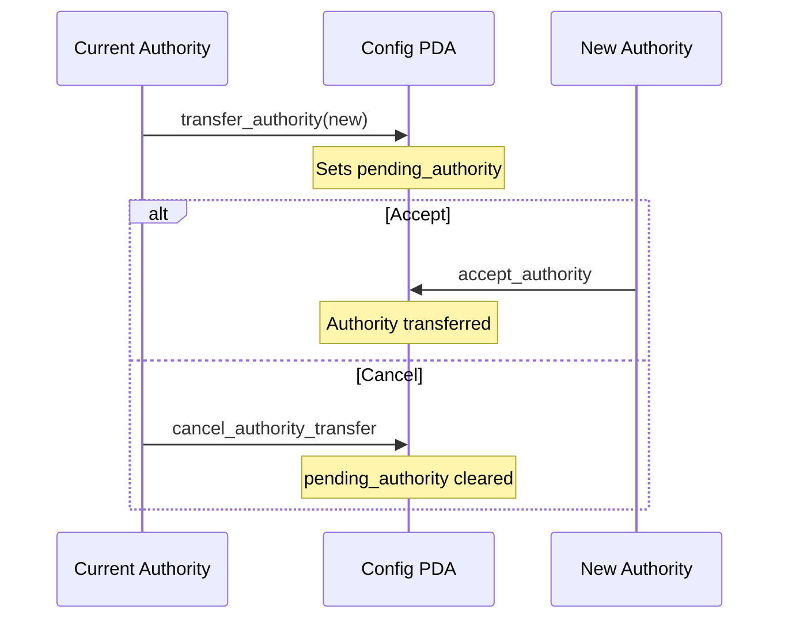
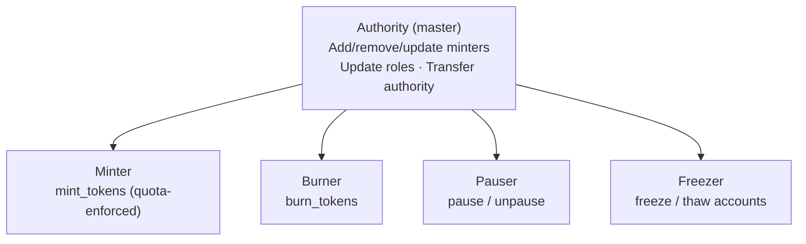

# SSS-1: Minimal Stablecoin Standard

**Status:** Active
**Type:** Standard
**Created:** 2025

---

## Abstract

SSS-1 defines the minimal viable stablecoin specification on Solana using the Token-2022 program. It provides a standardized interface for issuing, managing, and controlling stablecoins with essential operational capabilities including minting with quota enforcement, burning, freezing individual accounts, and emergency pause. SSS-1 is designed for use cases where compliance requirements are reactive rather than proactive -- issuers freeze or pause as needed rather than restricting every transfer at execution time.

---

## Motivation

Not every stablecoin requires the full compliance apparatus of a USDC or USDT. Many legitimate use cases call for a simpler token with basic operational controls:

- **DAO treasury tokens** that represent claims on a shared treasury.
- **Internal settlement tokens** used between known counterparties within a protocol or consortium.
- **Reward tokens** distributed by applications to their users.
- **Gaming currencies** backed by reserves held off-chain or in a vault.

These tokens still need professional-grade controls -- the ability to pause in an emergency, freeze a compromised account, enforce minting quotas, and transfer administrative authority safely. SSS-1 provides exactly this without the overhead of transfer hooks, permanent delegates, or default-frozen accounts.

By standardizing on a single program (`sss-core` at `4H5fRECQ4HLMGhabHEkzAya34pVZn8WBMqUw5TyhMAvb`), SSS-1 tokens share a common interface, making them straightforward to integrate into wallets, DEXs, and indexing infrastructure.

---

## Specification

### Token Program

SSS-1 tokens are minted through the **Solana Token-2022** (SPL Token Extensions) program. Token-2022 is required because SSS-1 uses the Metadata Pointer extension for on-chain metadata storage.

### Token-2022 Extensions

An SSS-1 token uses the following extension:

| Extension | Purpose |
|-----------|---------|
| **MetadataPointer** | Points to the mint account itself for on-chain metadata (name, symbol, URI, additional fields). The update authority is the Config PDA. |

The following extensions are explicitly **not enabled** in SSS-1:

| Extension | Status | Reason |
|-----------|--------|--------|
| PermanentDelegate | Disabled | No seizure capability needed. |
| TransferHook | Disabled | No pre-transfer enforcement needed. |
| DefaultAccountState | Disabled | Accounts are active immediately; no allowlist model. |

### Mint and Freeze Authority

Both the **mint authority** and **freeze authority** are set to the `StablecoinConfig` PDA, derived with seeds `["stablecoin_config", mint_pubkey]`. This PDA is controlled exclusively by the `sss-core` program, ensuring that minting and freezing can only occur through the program's instruction set and role-based access control.

No external wallet directly holds mint or freeze authority. All privileged operations require the appropriate role to invoke an `sss-core` instruction, which then signs with the Config PDA.

### Configuration

An SSS-1 token is initialized with the following configuration flags:

```
enable_permanent_delegate: false
enable_transfer_hook:      false
default_account_frozen:    false
```

These flags are stored on-chain in the `StablecoinConfig` account and are immutable after initialization.

### On-Chain State

#### StablecoinConfig

The Config PDA stores all administrative state for the token:

| Field | Type | Description |
|-------|------|-------------|
| `authority` | `Pubkey` | Master authority. Can update roles and transfer authority. |
| `mint` | `Pubkey` | The Token-2022 mint address. |
| `pauser` | `Pubkey` | Address authorized to pause/unpause operations. |
| `burner` | `Pubkey` | Address authorized to burn tokens. |
| `freezer` | `Pubkey` | Address authorized to freeze/thaw token accounts. |
| `blacklister` | `Pubkey` | Not used in SSS-1 (set to authority by default). |
| `seizer` | `Pubkey` | Not used in SSS-1 (set to authority by default). |
| `pending_authority` | `Option<Pubkey>` | Pending authority for two-step transfer. |
| `decimals` | `u8` | Token decimal places. |
| `is_paused` | `bool` | Whether operations are currently paused. |
| `has_metadata` | `bool` | Whether on-chain metadata was initialized. |
| `total_minters` | `u16` | Count of registered minters. |
| `enable_permanent_delegate` | `bool` | `false` for SSS-1. |
| `enable_transfer_hook` | `bool` | `false` for SSS-1. |
| `default_account_frozen` | `bool` | `false` for SSS-1. |
| `bump` | `u8` | PDA bump seed. |

#### MinterInfo

Each authorized minter has a PDA derived with seeds `["minter_info", config_pubkey, minter_pubkey]`:

| Field | Type | Description |
|-------|------|-------------|
| `config` | `Pubkey` | The Config PDA this minter belongs to. |
| `minter` | `Pubkey` | The minter's wallet address. |
| `quota` | `u64` | Maximum cumulative tokens this minter may mint. |
| `minted` | `u64` | Cumulative tokens minted so far. |
| `active` | `bool` | Whether this minter is currently enabled. |
| `unlimited` | `bool` | If `true`, quota is not enforced. |
| `bump` | `u8` | PDA bump seed. |

---

## Instructions

### initialize

Creates a new SSS-1 stablecoin. Sets up the Token-2022 mint with the MetadataPointer extension, initializes the Config PDA, and writes on-chain metadata.

**Parameters:**
- `decimals: u8` -- Number of decimal places.
- `enable_metadata: bool` -- Whether to create on-chain metadata.
- `name: String` -- Token name (max 32 characters).
- `symbol: String` -- Token symbol (max 10 characters).
- `uri: String` -- Metadata URI (max 200 characters, required if metadata enabled).
- `additional_metadata: Vec<MetadataField>` -- Additional key-value metadata fields.
- `enable_permanent_delegate: false`
- `enable_transfer_hook: false`
- `default_account_frozen: false`
- `transfer_hook_program_id: None`

**Signer:** Authority (becomes the master authority and all initial roles).

### mint_tokens

Mints new tokens to a recipient's token account. The calling minter must have an active `MinterInfo` account with sufficient remaining quota (unless flagged as unlimited).

**Parameters:**
- `amount: u64` -- Number of tokens to mint (must be greater than zero).

**Signer:** Minter (must match an active MinterInfo PDA).

**Events emitted:** `TokensMinted { mint, minter, recipient, amount }`

### burn_tokens

Burns tokens from a token account. Requires the burner role.

**Parameters:**
- `amount: u64` -- Number of tokens to burn (must be greater than zero).

**Signer:** Burner.

**Events emitted:** `TokensBurned { mint, burner, amount }`

### freeze_account

Freezes a token account, preventing all transfers to and from it. Uses the Config PDA's freeze authority over the Token-2022 mint.

**Signer:** Freezer.

**Events emitted:** `AccountFrozen { mint, account, authority }`

### thaw_account

Unfreezes a previously frozen token account, restoring normal transfer capability.

**Signer:** Freezer.

**Events emitted:** `AccountThawed { mint, account, authority }`

### pause

Pauses all minting, burning, freezing, thawing, role updates, and authority transfers on this stablecoin. Does not affect existing token transfers (Token-2022 transfers are not gated by the pause flag in SSS-1).

**Signer:** Pauser.

**Events emitted:** `Paused { mint, pauser }`

### unpause

Resumes operations after a pause.

**Signer:** Pauser.

**Events emitted:** `Unpaused { mint, pauser }`

### add_minter

Registers a new minter with a specified quota.

**Parameters:**
- `minter_address: Pubkey` -- The wallet to authorize as a minter.
- `quota: u64` -- Maximum cumulative tokens this minter may mint.
- `unlimited: bool` -- If `true`, quota is not enforced.

**Signer:** Authority (master authority).

**Events emitted:** `MinterAdded { mint, minter_address, quota, unlimited }`

### remove_minter

Deregisters an existing minter by closing its MinterInfo PDA.

**Parameters:**
- `minter_address: Pubkey` -- The minter to remove.

**Signer:** Authority (master authority).

**Events emitted:** `MinterRemoved { mint, minter_address }`

### update_minter

Updates an existing minter's quota, active status, or unlimited flag.

**Parameters:**
- `minter_address: Pubkey` -- The minter to update.
- `quota: u64` -- New quota value.
- `active: bool` -- Whether the minter is enabled.
- `unlimited: bool` -- Whether to bypass quota enforcement.

**Signer:** Authority (master authority).

**Events emitted:** `UpdatedMinter { mint, minter_address, active, quota }`

### update_roles

Updates one or more operational roles (pauser, burner, freezer, blacklister, seizer). Each role is optional; only provided roles are updated. Zero-address (`Pubkey::default()`) is rejected.

**Parameters:**
- `new_pauser: Option<Pubkey>`
- `new_burner: Option<Pubkey>`
- `new_freezer: Option<Pubkey>`
- `new_blacklister: Option<Pubkey>`
- `new_seizer: Option<Pubkey>`

**Signer:** Authority (master authority).

**Events emitted:** `RolesUpdated { mint, old_pauser, new_pauser, old_burner, new_burner, old_freezer, new_freezer, old_blacklister, new_blacklister, old_seizer, new_seizer }`

### transfer_authority

Initiates a two-step authority transfer by setting a pending authority on the Config PDA. The new authority must call `accept_authority` to complete the transfer.

**Parameters:**
- `new_authority: Pubkey` -- The proposed new master authority.

**Signer:** Current authority.

**Events emitted:** `AuthorityTransferProposed { mint, current_authority, proposed_authority }`

### accept_authority

Completes a pending authority transfer. The caller must be the pending authority.

**Signer:** Pending authority.

**Events emitted:** `AuthorityTransferAccepted { mint, old_authority, new_authority }`

### cancel_authority_transfer

Cancels a pending authority transfer, clearing the `pending_authority` field.

**Signer:** Current authority.

**Events emitted:** `AuthorityTransferCancelled { mint, authority, cancelled_pending }`



---

## Role Model

SSS-1 enforces separation of duties through distinct roles, each stored as a `Pubkey` on the Config PDA:

| Role | Permissions | Default |
|------|-------------|---------|
| **Authority** (master) | Add/remove/update minters, update roles, transfer authority | Initializer |
| **Minter** | Mint tokens up to assigned quota (or unlimited) | Added explicitly via `add_minter` |
| **Burner** | Burn tokens from a token account | Initializer |
| **Pauser** | Pause and unpause all operations | Initializer |
| **Freezer** | Freeze and thaw individual token accounts | Initializer |



At initialization, the authority, pauser, burner, and freezer are all set to the initializing wallet. The authority should immediately assign these roles to separate keys for production deployments.

The **blacklister** and **seizer** roles exist on the Config PDA but are not functionally used in SSS-1 (they become active in SSS-2).

---

## Use Cases

### DAO Treasury Tokens

A DAO issues a token representing fractional claims on its treasury. The DAO multisig holds authority and can add minters (e.g., a governance-approved minting program) with strict quotas. The freezer can lock accounts subject to governance disputes.

### Internal Settlement

A consortium of protocols uses an SSS-1 token for clearing and settlement between them. Minting is limited to the settlement program (a single minter with unlimited flag). The pauser can halt settlement in case of a bug.

### Reward Tokens

A gaming platform issues reward tokens to players. Multiple minting endpoints (game servers) are registered as minters with individual quotas to limit exposure from any single compromised server.

### Gaming Currencies

In-game currencies backed by a reserve. The freeze authority provides a safety valve if an exploit is discovered, and the pause function serves as an emergency stop.

---

## Security Considerations

### Freeze Authority

The Config PDA holds freeze authority over the Token-2022 mint. This allows the freezer role to lock individual token accounts reactively -- for example, in response to a reported compromise or a law enforcement request. Freezing prevents all transfers to and from the account.

### Emergency Pause

The pause mechanism halts all `sss-core` program operations (minting, burning, freezing, thawing, role changes, authority transfers). It does not halt Token-2022 transfers directly, since SSS-1 does not use a transfer hook. Pause is a circuit breaker for the administrative layer.

### Two-Step Authority Transfer

Authority transfer uses a propose-then-accept pattern. The current authority proposes a new authority, and the new authority must explicitly accept. This prevents accidental loss of control due to typos or incorrect addresses. A pending transfer can also be cancelled by the current authority.

### PDA-Controlled Mint

No external wallet holds direct mint or freeze authority. The Config PDA is the sole authority, and it can only be invoked through the `sss-core` program's validated instruction handlers. This eliminates the risk of a raw keypair being used to mint tokens outside the program's controls.

---

## Limitations

- **No on-chain transfer restrictions.** SSS-1 does not use a transfer hook. Token transfers between non-frozen accounts cannot be blocked or intercepted pre-execution. Compliance enforcement is limited to freezing accounts after the fact.
- **No seizure capability.** SSS-1 does not enable a permanent delegate. Tokens cannot be forcibly transferred out of an account. If seizure is required, use SSS-2.
- **No allowlist model.** Token accounts are active immediately upon creation. There is no mechanism to require explicit approval before an account can send or receive tokens.
- **Pause does not stop transfers.** The pause flag only affects `sss-core` instructions. Token-2022 `transfer` and `transfer_checked` instructions continue to work for non-frozen accounts even when the stablecoin is paused.

For privacy-preserving stablecoins with encrypted balances, see [SSS-3](./SSS-3.md) (experimental).

For use cases requiring proactive compliance enforcement, transfer-level blacklisting, seizure, or an allowlist model, see [SSS-2](./SSS-2.md).

---

## Reference Implementation

- **sss-core program:** `4H5fRECQ4HLMGhabHEkzAya34pVZn8WBMqUw5TyhMAvb`
- **Source:** `programs/sss-core/`
- **IDL:** Generated by Anchor build

---

## Copyright

This specification is released under the project's LICENSE file.
