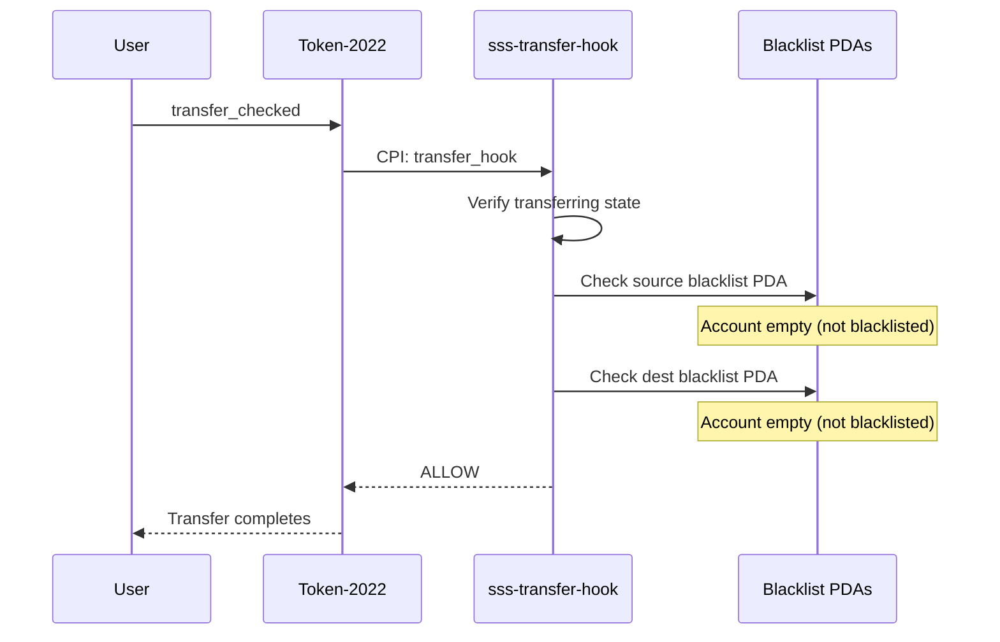
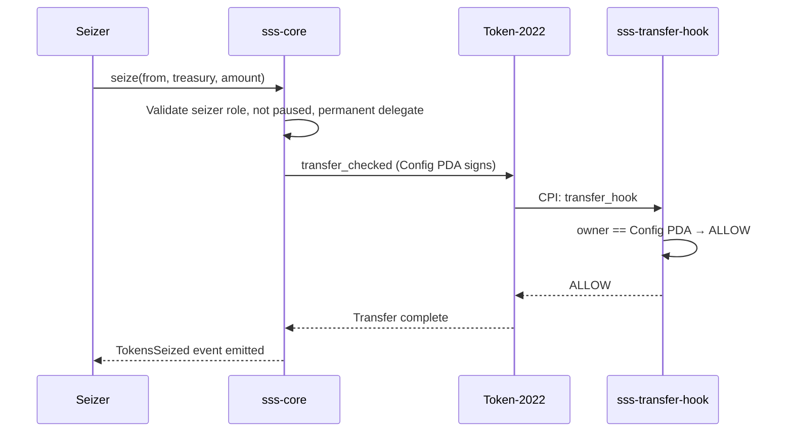

# SSS-2: Compliant Stablecoin Standard

**Status:** Active
**Type:** Standard
**Created:** 2025
**Requires:** SSS-1

---

## Abstract

SSS-2 extends the SSS-1 Minimal Stablecoin Standard with proactive compliance enforcement for regulated stablecoins on Solana. By enabling the Permanent Delegate, Transfer Hook, and Default Account State extensions of Token-2022, SSS-2 provides on-chain blacklist enforcement on every transfer, regulatory seizure capability, and an allowlist model where new token accounts must be explicitly approved before use. SSS-2 is designed for USDC/USDT-class tokens, bank-issued stablecoins, and any token where regulators expect enforceable transfer restrictions and asset recovery.

---

## Motivation

Regulated stablecoin issuers operate under legal frameworks that require more than reactive freeze-and-pause controls. Specifically:

- **OFAC sanctions compliance** requires that sanctioned addresses cannot send or receive tokens under any circumstances. A post-hoc freeze is insufficient; transfers must be blocked at execution time.
- **The GENIUS Act** (Guiding and Establishing National Innovation for U.S. Stablecoins) establishes a federal framework for payment stablecoins that mandates issuer controls over token movement, including the ability to enforce sanctions lists and comply with law enforcement orders.
- **AML/KYC enforcement** requires that issuers can prevent unverified addresses from holding or transacting in the token, and can seize tokens from accounts subject to court orders.
- **Bank-issued tokens** must meet prudential standards that include the ability to recover assets from compromised or sanctioned accounts.

SSS-1's reactive model (freeze after the fact) does not satisfy these requirements. SSS-2 closes the gap by enforcing compliance on every transfer through a transfer hook, enabling seizure through a permanent delegate, and implementing an allowlist model through default-frozen accounts.

---

## Specification

### Relationship to SSS-1

SSS-2 is a superset of SSS-1. All SSS-1 instructions, roles, state accounts, and events are present and function identically. SSS-2 adds three Token-2022 extensions and three additional instructions.

A single `sss-core` program deployment supports both SSS-1 and SSS-2 tokens. The difference is determined at initialization time by the configuration flags.

### Token-2022 Extensions

An SSS-2 token uses all SSS-1 extensions plus the following:

| Extension | Purpose |
|-----------|---------|
| **MetadataPointer** | On-chain metadata (same as SSS-1). |
| **PermanentDelegate** | The Config PDA is the permanent delegate on all token accounts, enabling seizure. |
| **TransferHook** | Every `transfer_checked` call invokes the `sss-transfer-hook` program to check blacklists. |
| **DefaultAccountState** | New token accounts are created in a **frozen** state, requiring explicit thaw (allowlisting). |

### Configuration

An SSS-2 token is initialized with the following configuration flags:

```
enable_permanent_delegate: true
enable_transfer_hook:      true
default_account_frozen:    true
```

The `transfer_hook_program_id` parameter must be set to the `sss-transfer-hook` program address (`2VymphXYSrCV4qtS3FyiGmNQvcNrEXNUyRUh9MhDTLH9`).

These flags are stored on-chain in the `StablecoinConfig` account and are immutable after initialization.

### Permanent Delegate

The Config PDA (`seeds: ["stablecoin_config", mint_pubkey]`) is set as the permanent delegate on the Token-2022 mint. This grants the Config PDA the authority to transfer tokens out of any token account associated with this mint, regardless of the account owner's consent.

This capability is exposed exclusively through the `seize` instruction, which is gated by the seizer role. The permanent delegate cannot be invoked outside of the `sss-core` program because only the program can sign with the Config PDA.

### Transfer Hook

The `sss-transfer-hook` program (`2VymphXYSrCV4qtS3FyiGmNQvcNrEXNUyRUh9MhDTLH9`) is registered as the transfer hook on the Token-2022 mint. Every call to `transfer_checked` (the only transfer instruction that works with transfer hooks) triggers the following flow:

```
Token-2022 transfer_checked
    |
    v
sss-transfer-hook::transfer_hook(source, mint, destination, owner, amount)
    |
    +-- Verify the source token account is in "transferring" state
    |   (prevents direct invocation outside of Token-2022)
    |
    +-- If owner == Config PDA: ALLOW
    |   (permits seizure and program-initiated transfers)
    |
    +-- Check source_blacklist_entry PDA: if account exists -> DENY
    |
    +-- Check dest_blacklist_entry PDA: if account exists -> DENY
    |
    +-- Both clear: ALLOW
```

The transfer hook resolves blacklist PDAs using the `ExtraAccountMetaList` mechanism. For each transfer, Token-2022 automatically derives and includes:

1. The `sss-core` program ID (index 5).
2. The Config PDA (index 6), derived from `["stablecoin_config", mint_pubkey]` on the `sss-core` program.
3. The source blacklist entry PDA (index 7), derived from `["blacklist_seed", config_pubkey, source_owner_pubkey]` on the `sss-core` program.
4. The destination blacklist entry PDA (index 8), derived from `["blacklist_seed", config_pubkey, dest_owner_pubkey]` on the `sss-core` program.

The hook checks whether each blacklist PDA account has data. If either account is non-empty (meaning a `BlacklistEntry` has been initialized), the transfer is denied with a `Blacklisted` error. If both accounts are empty (no blacklist entry exists), the transfer proceeds.

### Default Frozen Accounts

When `default_account_frozen` is `true`, the Token-2022 `DefaultAccountState` extension causes all newly created token accounts to start in a **frozen** state. The account owner cannot send or receive tokens until the freezer role explicitly thaws the account.

This creates an allowlist model: only accounts that have been reviewed and thawed by the issuer can participate in the token economy. Combined with the transfer hook blacklist, this provides two layers of access control.

### Blacklist PDAs

Blacklist entries are on-chain PDA accounts managed by the `sss-core` program:

**Seeds:** `["blacklist_seed", config_pubkey, address]`

| Field | Type | Description |
|-------|------|-------------|
| `config` | `Pubkey` | The Config PDA this entry belongs to. |
| `address` | `Pubkey` | The blacklisted wallet address. |
| `bump` | `u8` | PDA bump seed. |

**Presence semantics:** The existence of a `BlacklistEntry` account at the derived PDA address means the address is blacklisted. Removing from the blacklist closes (deletes) the PDA account. The transfer hook checks `data_is_empty()` on the derived PDA -- if the account has data, the address is blacklisted.

This design avoids maintaining a list or bitmap. Each blacklist check is a single PDA derivation and an account existence check, which is constant-time and does not grow with the number of blacklisted addresses.

---

## Additional Instructions

SSS-2 includes all SSS-1 instructions plus the following:

### blacklist_address

Adds an address to the blacklist by initializing a `BlacklistEntry` PDA. Once blacklisted, the address cannot send or receive tokens (enforced by the transfer hook on every transfer). The blacklisted address does not need to hold a token account -- blacklisting is at the wallet level.

**Parameters:**
- `address: Pubkey` -- The wallet address to blacklist.

**Signer:** Blacklister.

**Constraints:**
- Config must not be paused.
- Transfer hook must be enabled (`enable_transfer_hook == true`). If not, returns `ComplianceNotEnabled`.

**Events emitted:** `AddedToBlacklist { mint, address }`

### remove_from_blacklist

Removes an address from the blacklist by closing (deleting) its `BlacklistEntry` PDA. The rent-exempt lamports are returned to the blacklister. Once removed, the address can send and receive tokens normally (assuming their token account is not frozen).

**Parameters:**
- `address: Pubkey` -- The wallet address to remove from the blacklist.

**Signer:** Blacklister.

**Events emitted:** `RemovedFromBlacklist { mint, address }`

### seize

Transfers tokens from a target token account to a treasury token account using the Config PDA's permanent delegate authority. This is the regulatory seizure mechanism -- it does not require the token account owner's signature.

**Parameters:**
- `amount: u64` -- Number of tokens to seize (must be greater than zero).

**Signer:** Seizer.

**Accounts:**
- `from` -- The token account to seize from.
- `treasury` -- The token account to receive seized tokens.
- Remaining accounts: Transfer hook extra account metas (automatically resolved).

**Constraints:**
- Config must not be paused.
- Permanent delegate must be enabled (`enable_permanent_delegate == true`). If not, returns `ComplianceNotEnabled`.

**Implementation detail:** The `seize` instruction builds a `transfer_checked` instruction with the Config PDA as the signing authority. If the transfer hook is also enabled, the hook's extra account metas must be passed as remaining accounts. The transfer hook allows transfers where the owner (signer) is the Config PDA, so seizure is not blocked by the blacklist check.

**Events emitted:** `TokensSeized { mint, from, treasury, amount }`

---

## Additional Roles

SSS-2 activates two roles that exist on the Config PDA but are dormant in SSS-1:

| Role | Permissions | Default |
|------|-------------|---------|
| **Blacklister** | Add and remove addresses from the blacklist | Initializer |
| **Seizer** | Seize tokens from any account via permanent delegate | Initializer |

These roles are managed through the same `update_roles` instruction as SSS-1 roles. The authority should assign blacklister and seizer to dedicated keys, separate from each other and from the master authority.

### Complete Role Summary (SSS-2)

| Role | SSS-1 | SSS-2 | Permissions |
|------|-------|-------|-------------|
| Authority | Active | Active | Manage minters, update roles, transfer authority |
| Minter | Active | Active | Mint tokens within quota |
| Burner | Active | Active | Burn tokens |
| Pauser | Active | Active | Pause/unpause operations |
| Freezer | Active | Active | Freeze/thaw individual accounts |
| Blacklister | Dormant | Active | Add/remove blacklist entries |
| Seizer | Dormant | Active | Seize tokens via permanent delegate |

---

## Transfer Hook Flow

The following describes the complete lifecycle of a transfer for an SSS-2 token:

### Normal Transfer (non-blacklisted parties)



1. User calls `transfer_checked` on Token-2022 with the token mint.
2. Token-2022 detects the TransferHook extension and invokes `sss-transfer-hook::transfer_hook`.
3. The hook verifies the source token account is in "transferring" state (preventing direct invocation).
4. The hook checks if the owner is the Config PDA. If so, the transfer is allowed (this path is used by seizure).
5. The hook derives the source blacklist PDA and checks if the account is empty. It is empty (not blacklisted).
6. The hook derives the destination blacklist PDA and checks if the account is empty. It is empty (not blacklisted).
7. The hook returns success. Token-2022 completes the transfer.

### Blocked Transfer (blacklisted party)

1. User calls `transfer_checked` on Token-2022.
2. Token-2022 invokes `sss-transfer-hook::transfer_hook`.
3. The hook derives the source or destination blacklist PDA and finds a non-empty account (a `BlacklistEntry` exists).
4. The hook returns `Blacklisted` error. Token-2022 reverts the entire transaction.

### Seizure Transfer

1. Seizer calls `sss-core::seize` with the target account, treasury account, and amount.
2. `sss-core` validates the seizer role and that permanent delegate is enabled.
3. `sss-core` builds a `transfer_checked` instruction signed by the Config PDA (permanent delegate).
4. Token-2022 invokes the transfer hook. The hook sees that the owner (signer) is the Config PDA and allows the transfer immediately, bypassing blacklist checks.
5. Tokens are transferred from the target to the treasury.
6. `TokensSeized` event is emitted.

---

## Seizure Flow



---

## Compliance Features

### Audit Trail

Every state-changing operation emits an Anchor event that can be captured by indexers:

| Event | Trigger |
|-------|---------|
| `Initialized` | Token created |
| `TokensMinted` | Tokens minted |
| `TokensBurned` | Tokens burned |
| `AccountFrozen` | Account frozen |
| `AccountThawed` | Account thawed |
| `Paused` | Operations paused |
| `Unpaused` | Operations unpaused |
| `AddedToBlacklist` | Address blacklisted |
| `RemovedFromBlacklist` | Address removed from blacklist |
| `TokensSeized` | Tokens seized via permanent delegate |
| `MinterAdded` | Minter registered |
| `MinterRemoved` | Minter deregistered |
| `UpdatedMinter` | Minter quota/status changed |
| `RolesUpdated` | Operational roles changed |
| `AuthorityTransferProposed` | Authority transfer initiated |
| `AuthorityTransferAccepted` | Authority transfer completed |
| `AuthorityTransferCancelled` | Authority transfer cancelled |

### Blacklist Management

The blacklist operates at the wallet address level, not the token account level. A single blacklist entry for a wallet address blocks all token accounts owned by that wallet, because the transfer hook resolves the owner from the token account data (bytes 32-64) and checks the blacklist against the owner.

Blacklist entries are independent per stablecoin. Blacklisting an address on one SSS-2 token does not affect other tokens.

### Sanctions Screening Integration

The blacklist management instructions (`blacklist_address`, `remove_from_blacklist`) provide the on-chain enforcement point. Off-chain systems (compliance services, sanctions screening providers) determine which addresses to blacklist. The integration pattern is:

1. Compliance service monitors sanctions lists (OFAC SDN, EU sanctions, etc.).
2. When a match is found, the service calls `blacklist_address` via the blacklister key.
3. The on-chain blacklist entry is created, and all subsequent transfers involving that address are blocked.
4. When a false positive is resolved, the service calls `remove_from_blacklist`.

---

## Use Cases

### Regulated Stablecoins

A licensed money transmitter issues a USD-backed stablecoin. SSS-2 provides the compliance infrastructure required by state and federal regulators: blacklist enforcement for OFAC compliance, seizure capability for law enforcement orders, and a complete audit trail for examinations.

### Bank-Issued Tokens

A chartered bank issues a deposit token on Solana. The default-frozen account model ensures that only KYC-verified customers can hold the token (accounts are thawed after verification). The transfer hook ensures that if a customer is later flagged, their transfers are blocked immediately.

### Compliant Payment Tokens

A payment network issues a settlement token used by merchants and processors. The allowlist model (default frozen) ensures all participants are vetted. The blacklist provides a mechanism to remove participants who violate network rules or are subject to regulatory action.

---

## Regulatory Alignment

### GENIUS Act

The GENIUS Act requires payment stablecoin issuers to maintain reserves, register with regulators, and implement compliance controls. SSS-2 addresses the compliance control requirements:

- **Sanctions compliance:** Transfer hook blacklist enforces OFAC SDN list.
- **Asset recovery:** Permanent delegate seizure capability for court-ordered recovery.
- **Record keeping:** On-chain events provide an immutable audit trail.

### OFAC Compliance

SSS-2's transfer hook checks every transfer against the blacklist. This provides a technical control that maps directly to OFAC's requirement that US persons not engage in transactions with sanctioned entities. The blacklist can be updated in real time as the SDN list changes.

### AML/KYC Enforcement

The default-frozen account model supports KYC enforcement: accounts are only thawed after the holder has completed identity verification. The blacklist supports ongoing AML monitoring: addresses flagged by transaction monitoring systems can be blacklisted immediately.

---

## Reference Implementation

- **sss-core program:** `4H5fRECQ4HLMGhabHEkzAya34pVZn8WBMqUw5TyhMAvb`
- **sss-transfer-hook program:** `2VymphXYSrCV4qtS3FyiGmNQvcNrEXNUyRUh9MhDTLH9`
- **Source:** `programs/sss-core/` and `programs/sss-transfer-hook/`
- **IDL:** Generated by Anchor build

---

## Related Standards

- [SSS-1](./SSS-1.md) -- Minimal Stablecoin (base standard)
- [SSS-3](./SSS-3.md) -- Private Stablecoin (experimental, confidential transfers)

---

## Copyright

This specification is released under the project's LICENSE file.
