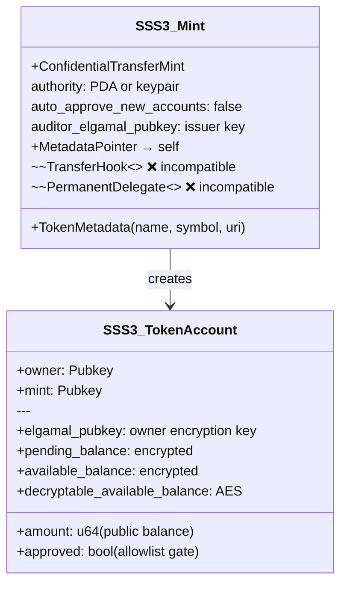
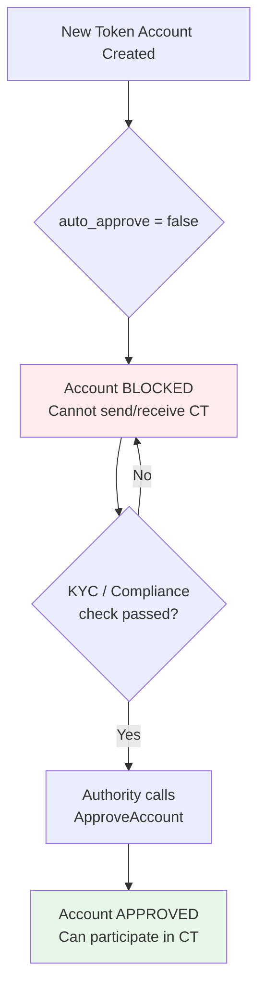
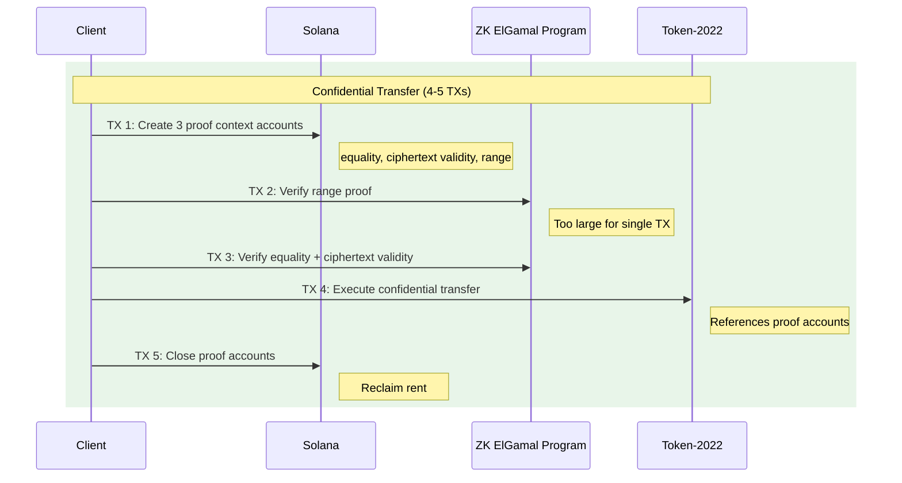

# SSS-3: Private Stablecoin Standard (Proof-of-Concept)

## Status: Experimental

> The ZK ElGamal Proof Program required for confidential transfers has been **disabled on devnet and mainnet** since June 2025 due to a cryptographic vulnerability. SSS-3 is documented as a proof-of-concept. Use a local test validator for testing.

---

## Overview

SSS-3 extends SSS-1 with **confidential transfers** and **scoped allowlists**, enabling privacy-preserving stablecoins where transfer amounts and balances are encrypted on-chain while addresses remain public.

| Feature | SSS-1 | SSS-2 | SSS-3 |
|---------|-------|-------|-------|
| Metadata | Yes | Yes | Yes |
| Mint/Freeze Authority | Yes | Yes | Yes |
| Permanent Delegate | No | Yes | No |
| Transfer Hook | No | Yes | **No** (incompatible) |
| Confidential Transfers | No | No | **Yes** |
| Compliance Model | Reactive (freeze) | Proactive (blacklist) | **Allowlist** (approval) |

### Key Design Constraint

**Confidential transfers are incompatible with transfer hooks.** Transfer hooks read the transfer amount, but confidential transfers encrypt it. SSS-3 replaces hook-based compliance (SSS-2) with an approval-authority pattern using the `ConfidentialTransferMint` extension's built-in allowlist mechanism.

---

## Architecture



### Compliance: Approval-Authority Pattern

Instead of blacklist enforcement via transfer hooks (SSS-2), SSS-3 uses an **allowlist**:



This is equivalent to SSS-2's blacklist but inverted: deny by default, approve explicitly.

### Auditor Key

Every SSS-3 mint includes an `auditor_elgamal_pubkey`. When set, every confidential transfer encrypts the amount for the auditor in addition to sender and recipient. This enables:

- Regulatory audit of all transfer amounts
- Compliance reporting without revealing amounts publicly
- The auditor can decrypt amounts but not spend tokens

---

## Confidential Transfer Lifecycle

### 1. Mint Creation

```typescript
import { ConfidentialMint } from "@stbr/sss-confidential";

const manager = new ConfidentialMint(connection, payer);
const { mint, signature } = await manager.createMint({
  authority: payer.publicKey,
  decimals: 6,
  name: "Private BRL",
  symbol: "pBRL",
  uri: "",
  autoApproveNewAccounts: false,  // allowlist model
  auditorElGamalPubkey: auditorKey, // 32-byte ElGamal pubkey
});
```

Or via CLI:

```bash
sss-token init --preset sss-3 --name "Private BRL" --symbol pBRL
```

### 2. Account Setup

```typescript
import { ConfidentialAccountManager } from "@stbr/sss-confidential";

const accounts = new ConfidentialAccountManager(connection, mint);

// Check account status
const status = await accounts.getAccountStatus(userWallet);
// { exists: true, configured: false, approved: false, publicBalance: "0" }

// Authority approves account (allowlist gate)
await accounts.approveAccount(tokenAccount, authority);
```

### 3. Deposit (Public → Confidential)

No ZK proof required. Moves tokens from public balance to encrypted pending balance.

```typescript
await accounts.deposit(owner, BigInt(1_000_000), 6); // 1.0 tokens
```

### 4. Apply Pending Balance

Merges pending balance into available balance. Requires off-chain computation with owner's ElGamal key.

### 5. Confidential Transfer (4-5 transactions)



Each transfer requires:
- **Equality proof**: sender's encrypted balance matches committed amount
- **Ciphertext validity proof**: recipient's and auditor's ciphertexts are valid encryptions
- **Range proof**: transfer amount is non-negative and within bounds

### 6. Withdraw (Confidential → Public)

Similar to transfer but only needs equality + range proofs (3-4 transactions).

---

## Privacy Scope

| Public | Private |
|--------|---------|
| Sender address | Transfer amount |
| Recipient address | Account balance |
| Transaction timestamp | |
| That a confidential transfer occurred | |

**Addresses are fully public.** Only amounts and balances are encrypted. A chain analyst can see who transacted with whom, but not how much.

---

## Extension Compatibility Matrix

| Extension | Compatible with SSS-3? | Notes |
|-----------|----------------------|-------|
| MetadataPointer | Yes | Required for token metadata |
| ConfidentialTransferMint | Yes | Core SSS-3 extension |
| ConfidentialMintBurn | Yes | Optional: hide issuance amounts |
| TransferFeeConfig | Yes | Via `TransferWithFee` variant |
| **TransferHook** | **No** | Reads amount; CT encrypts it |
| **PermanentDelegate** | Possible | Not used in SSS-3 preset |
| DefaultAccountState | Yes | Can default-freeze accounts |

---

## Limitations

### ZK ElGamal Program Disabled

The ZK ElGamal Proof Program was disabled on devnet and mainnet on June 19, 2025 (epoch 805) due to a vulnerability in the Fiat-Shamir transformation that could allow forged proofs. Two audits (Code4rena in Sep 2025, Least Authority in Nov 2025) have completed, but re-enablement has not been confirmed as of March 2026.

**Impact:** Confidential transfers, withdrawals, and any operation requiring ZK proofs cannot execute on devnet/mainnet.

**Workaround:** Use `solana-test-validator` with the Token-2022 program for local testing.

### Transaction Complexity

Each confidential transfer requires **4-5 separate transactions** due to Solana's 1,232-byte size limit. The range proof alone exceeds a single transaction. For atomic execution, Jito bundles are recommended.

### Key Management

ElGamal and AES keys are derived deterministically from the owner's signer key. If a user loses their private key, their encrypted balance is **permanently unrecoverable**.

### Single Auditor Key

Only one auditor ElGamal key per mint. There is no per-account or per-transaction auditor routing without a custom key-sharing implementation.

### Pending Balance Race Condition

If a user receives a transfer while computing `ApplyPendingBalance`, the pending credit counter changes and the operation fails. Must retry with fresh on-chain data.

---

## Module Reference

### `@stbr/sss-confidential`

```typescript
// Mint creation
import { ConfidentialMint } from "@stbr/sss-confidential";
const mint = new ConfidentialMint(connection, payer);
await mint.createMint(config);

// Account management
import { ConfidentialAccountManager } from "@stbr/sss-confidential";
const mgr = new ConfidentialAccountManager(connection, mintPubkey);
await mgr.getAccountStatus(owner);
await mgr.approveAccount(tokenAccount, authority);
await mgr.deposit(owner, amount, decimals);

// Constants
import { SSS3_CONSTRAINTS, SSS3_EXTENSION_CONFIG } from "@stbr/sss-confidential";
```

### CLI

```bash
# Initialize SSS-3 mint
sss-token init --preset sss-3 --name "Private BRL" --symbol pBRL

# Note: SSS-3 operations require additional client-side setup
# for ElGamal key generation and ZK proof computation.
```

---

## Comparison with Other Standards

### SSS-2 vs SSS-3: Compliance Trade-offs

| Aspect | SSS-2 (Compliant) | SSS-3 (Private) |
|--------|-------------------|-----------------|
| Compliance gate | Blacklist (deny-list) | Allowlist (approve) |
| Enforcement | Transfer hook on every transfer | Account approval before first use |
| Amount visibility | Public on-chain | Encrypted on-chain |
| Audit | Transaction logs | Auditor ElGamal key |
| Seizure | Permanent delegate | Not supported |
| Transfer cost | 1 transaction | 4-5 transactions |
| Tooling maturity | Production-ready | Experimental |

### When to Use SSS-3

- Privacy-preserving payroll stablecoins
- Institutional settlement with amount confidentiality
- Jurisdictions requiring transaction privacy
- Research and proof-of-concept development

### When NOT to Use SSS-3

- When transfer hooks are required (incompatible)
- When seizure/clawback is needed (no permanent delegate)
- When targeting devnet/mainnet today (ZK program disabled)
- When single-transaction UX is required

---

## Roadmap

1. **Current (PoC):** Mint creation, account management, deposit, constants and type definitions
2. **When ZK re-enabled:** Full confidential transfer flow with proof generation
3. **Future:** ConfidentialMintBurn integration for hidden issuance, multi-auditor key sharing, Jito bundle integration for atomic transfers

---

## References

- [Solana Confidential Transfer Docs](https://solana.com/docs/tokens/extensions/confidential-transfer)
- [Confidential-Balances-Sample (GitHub)](https://github.com/solana-developers/Confidential-Balances-Sample)
- [Post Mortem: ZK ElGamal Proof Program Bug, June 2025](https://solana.com/news/post-mortem-june-25-2025)
- [spl-token-confidential-transfer-proof-generation (crates.io)](https://crates.io/crates/spl-token-confidential-transfer-proof-generation)
